# RAG Workshop

## .NET 10 + Qdrant + OpenAI

Build a complete **Retrieval-Augmented Generation** solution from scratch

<br>

📦 [`github.com/PeterMilovcik/Qdrant.Demo`](https://github.com/PeterMilovcik/Qdrant.Demo)

<!-- Welcome everyone! Today we'll build a complete RAG system from scratch — from an empty API to a working chat UI with semantic search, metadata filtering, and grounded AI answers. -->

---

# Agenda

<style> table { font-size: 0.6em; } </style>

| # | Module | Topic | ⏱ |
|---|--------|-------|---|
| 0 | Setup & Orientation | Docker, Qdrant Dashboard, Swagger UI | 15 min |
| 1 | Your First Document | Embeddings, deterministic IDs, upserts | 15 min |
| 2 | Similarity Search | Cosine similarity, Top-K search | 15 min |
| 3 | Metadata | Tags vs Properties, payload prefixes | 10 min |
| 4 | Filtered Search | Tag filters, threshold, metadata-only | 20 min |
| 5 | RAG Chat | Full RAG pipeline, system prompt | 20 min |
| 6 | Advanced Chat | Custom prompts, filtered retrieval | 15 min |
| 7 | Chunking | Text splitting, overlap, sentence boundaries | 25 min |
| 8 | Batch Operations | Bulk indexing, partial-failure handling | 10 min |
| 9 | Chat UI | Static frontend, visual RAG experience | 20 min |

**Total ≈ 3 hours** at a comfortable pace

<!-- Each module is self-contained and fully buildable. You'll start from zero and end with a production-style RAG API + UI. -->

---

# What is RAG?

**Retrieval-Augmented Generation** — a three-step pattern:

<br>

### 1. **Index** — Turn documents into vectors, store in a vector database

### 2. **Retrieve** — Embed the user's query, find most similar documents

### 3. **Generate** — Feed retrieved documents into an LLM for a grounded answer


<!-- This is the big picture. We embed documents into vectors, store them in Qdrant, then when a user asks a question, we retrieve the relevant docs and give them to the LLM as context. The LLM answers from YOUR data, not from its training. -->

---

# Why RAG?

<br>

| Without RAG | With RAG |
|-------------|----------|
| LLM answers from training data only | LLM answers from **your documents** |
| May hallucinate facts | Grounded — cites what's actually indexed |
| Generic answers | Specific to your domain |
| Training cutoff | Always current (re-index anytime) |

<br>

> **Key insight:** Instead of hoping the AI "knows" the answer, you **feed it the right documents first** — so every response is grounded in facts, not guesswork.

<!-- The fundamental problem with LLMs is they make stuff up. RAG solves this by giving the LLM factual context before asking it to answer. -->

---

# Prerequisites

| Tool | Version | Why |
|------|---------|-----|
| Docker Desktop | 4.x+ | Runs the Qdrant vector database |
| .NET 10 SDK | 10.0+ | Build & run the API locally |
| OpenAI API key | — | Embeddings + chat |
| `curl` or Swagger | — | Test the endpoints |

<br>

### Quick check

```bash
docker --version        # 27.x or later
dotnet --version        # 10.0.101 or later
```

<br>

> **Cost note:** Expected cost is well under **$1** per participant for the full workshop.

<!-- Make sure everyone has these running. We'll use Swagger UI for most testing, but curl works too. -->

---

# Tech Stack

<style> table { font-size: 0.8em; } </style>

| Component | Role |
|-----------|------|
| **Qdrant** (Docker) | Open-source vector database — stores embeddings + metadata |
| **.NET 10 Minimal API** | Exposes indexing, search, and chat endpoints |
| **OpenAI Embeddings** | `text-embedding-3-small` — 1536 dimensions |
| **OpenAI Chat** | `gpt-4o-mini` — generates grounded answers |
| **Docker Compose** | Runs Qdrant in a container |

Each module folder (`module-XX/`) is **self-contained** — its own `README.md`, solution, source, and tests.

<!-- Every module builds and runs independently. No shared state between modules. -->

---
layout: section
---

# Module 0
## Setup & Orientation

~15 min · No LLM needed · No code to write

<!-- Let's get everything running. This module is pure infrastructure — Docker, Qdrant, and the API skeleton. -->

---

# Module 0 — Qdrant Concepts

<style> table { font-size: 0.85em; } p, blockquote { font-size: 0.9em; } </style>

**Qdrant** is an open-source vector database. It stores **points**:

| Component | Description |
|-----------|-------------|
| **id** | UUID or integer — uniquely identifies each point |
| **vector** | Array of floats (1536 dimensions for our model) |
| **payload** | Key/value metadata (text, timestamps, tags) |

Points live inside **collections** — like a database table. All vectors in a collection share the same dimensionality.

> In this module, we create the empty `documents` collection. Points come in Module 1.

<!-- Think of a collection as a table. Each point is a row with an ID, a vector, and optional metadata. -->

---

# Module 0 — QdrantBootstrapper (1/2)

A background service that creates the collection at startup with retries:

```csharp {all|1-4|6-8|10-11|all}
sealed class QdrantBootstrapper(QdrantClient qdrant, string collection, int dim)
    : BackgroundService
{
    protected override async Task ExecuteAsync(CancellationToken stoppingToken)
    {
        for (var attempt = 1; attempt <= 30; attempt++)
        {
            try
            {
                await EnsureCollectionAsync(stoppingToken);
                Console.WriteLine($"[bootstrap] Collection '{collection}' ready.");
                return;
            }
            catch (Exception ex) when (!stoppingToken.IsCancellationRequested)
            {
                Console.WriteLine($"[bootstrap] attempt {attempt} failed: {ex.Message}");
                await Task.Delay(TimeSpan.FromSeconds(1), stoppingToken);
            }
        }
    }
```

30 retries × 1 s delay — tolerates Qdrant starting slowly.

<!-- The retry loop is defensive. In Docker Compose, the API often starts before Qdrant is ready. -->

---

# Module 0 — QdrantBootstrapper (2/2)

```csharp
    private async Task EnsureCollectionAsync(CancellationToken ct)
    {
        try {
            await qdrant.CreateCollectionAsync(collection,
                new VectorParams { Size = (uint)dim, Distance = Distance.Cosine },
                cancellationToken: ct);
        }
        catch (RpcException ex) when (ex.StatusCode == StatusCode.AlreadyExists) { }
    }
}
```

<br>

- **`AlreadyExists`** catch → idempotent — safe to restart the API
- **`Distance.Cosine`** → similarity metric for semantic search
- **1536 dimensions** → matches `text-embedding-3-small`

<!-- The AlreadyExists catch makes it idempotent. You can restart the API 100 times and it won't fail or create duplicates. -->

<!-- 30 retries with 1-second delay — tolerates Qdrant starting slowly. The AlreadyExists catch makes it idempotent. -->

---

# Module 0 — Program.cs (Skeleton)

```csharp {all|1-3|5-7|8-13|14-17|all}
var qdrantHost     = config["QDRANT_HOST"]       ?? config["Qdrant:Host"]       ?? "localhost";
var qdrantGrpcPort = int.Parse(config["QDRANT_GRPC_PORT"] ?? config["Qdrant:GrpcPort"] ?? "6334");
var collectionName = config["QDRANT_COLLECTION"] ?? config["Qdrant:Collection"] ?? "documents";

// Register Qdrant client
builder.Services.AddSingleton(_ => new QdrantClient(qdrantHost, qdrantGrpcPort));

// Start bootstrapper — creates collection with retries
builder.Services.AddHostedService(sp =>
    new QdrantBootstrapper(
        sp.GetRequiredService<QdrantClient>(),
        collectionName,
        embeddingDim));

// Endpoints
app.MapGet("/", () => Results.Ok(new { service = "Qdrant.Demo.Api", ... }));
app.MapGet("/health", () => Results.Ok("healthy"));
```

- Config reads from `appsettings.json` with **env-var overrides**
- Pattern: `ENV_VAR → appsettings key → default value`

<!-- This is the foundation. Every module builds on this skeleton. Notice the config pattern — environment variables always win. -->

---

# Module 0 — Steps

### 1. Start Qdrant

```bash
cd module-00
docker compose up -d
curl http://localhost:6333/healthz    # → ok
```

### 2. Run the API

```bash
cd src/Qdrant.Demo.Api
dotnet run
```

### 3. Explore

- **Swagger UI** → `http://localhost:8080/swagger`
- **Qdrant Dashboard** → `http://localhost:6333/dashboard`
- Verify: `documents` collection exists, 0 points, 1536 dim, Cosine distance

<!-- Everyone: open two browser tabs. One for Swagger, one for the Qdrant Dashboard. Keep them open. -->

---
layout: section
---

# Module 1
## Your First Document

~15 min · Requires OpenAI API key

<!-- Now we add embeddings. This is where the magic starts — turning text into vectors. -->

---

# Module 1 — What Are Embeddings?

<br>

An **embedding** is a list of floats that captures the **meaning** of text.

`text-embedding-3-small` → **1536 floats** per input

<br>

### Key insight

> Texts with **similar meaning** produce vectors that are **close together** in vector space.

| Text A | Text B | Similar? |
|--------|--------|----------|
| "The cat sat on the mat" | "A kitten was sitting on a rug" | ✅ Very close |
| "The cat sat on the mat" | "Stock prices rose yesterday" | ❌ Very far |

<br>

This is what makes **semantic search** possible — compare meaning, not keywords.

<!-- Same idea, different words → similar vectors. Different ideas → far apart. This is the foundation of everything we build today. -->

---

# Module 1 — The Indexing Pipeline

```mermaid {scale: 0.7}
flowchart LR
    A["POST /documents"] --> B["Hash ID → UUID"]
    B --> C["Embed text → 1536 floats"]
    C --> D["Build Qdrant point"]
    D --> E["Upsert into Qdrant"]
```

<br>



<br>

### Deterministic point-IDs

- If caller provides `id` → `SHA256("article-001")` → same UUID every time
- If no `id` → `SHA256(text)` → same text = same point

<br>

> **Re-indexing the same document is safe** — it overwrites, never duplicates. This is an **idempotent upsert**.

💡 **Upsert** = **up**date + in**sert** — if the ID exists, update it; if not, insert it.

<!-- The SHA-256 hash gives us deterministic IDs. Same input always produces the same UUID. -->

---

# Module 1 — StringExtensions.cs

Deterministic UUID via SHA-256:

```csharp
public static Guid ToDeterministicGuid(this string input)
{
    var hash = SHA256.HashData(Encoding.UTF8.GetBytes(input));

    Span<byte> g = stackalloc byte[16];
    hash.AsSpan(0, 16).CopyTo(g);

    g[6] = (byte)((g[6] & 0x0F) | 0x50);  // version 5
    g[8] = (byte)((g[8] & 0x3F) | 0x80);  // RFC 4122 variant

    return new Guid(g);
}
```

<br>

Same input → same GUID, every time. **No duplicates, ever.**

<!-- We take 16 bytes of the SHA-256 hash, stamp them with UUID version 5 markers, and we get a stable, repeatable ID. -->

---

# Module 1 — EmbeddingService.cs

A thin wrapper around Microsoft.Extensions.AI:

```csharp
public sealed class EmbeddingService(
    IEmbeddingGenerator<string, Embedding<float>> generator) : IEmbeddingService
{
    public async Task<float[]> EmbedAsync(string text, CancellationToken ct = default)
    {
        var embedding = await generator.GenerateAsync(
            [text], cancellationToken: ct);
        return embedding[0].Vector.ToArray();
    }
}
```

<br>

- Depends on the `IEmbeddingGenerator` **interface** (not the OpenAI SDK directly)
- Easy to mock in unit tests
- One text in → one 1536-float vector out

<!-- The abstraction is important. We program against IEmbeddingGenerator, not OpenAI. We could swap in a local model and nothing else changes. -->

---

# Module 1 — DocumentIndexer.cs

The orchestrator: hash → embed → build point → upsert:

```csharp {all|1-3|5|7-16|18|all}
var idSource = !string.IsNullOrWhiteSpace(request.Id)
    ? request.Id! : request.Text;
var pointId = idSource.ToDeterministicGuid().ToString("D");

var vector = await embeddings.EmbedAsync(request.Text, ct);

var point = new PointStruct
{
    Id = new PointId { Uuid = pointId },
    Vectors = vector,
    Payload =
    {
        [Text] = request.Text,
        [IndexedAtMs] = DateTime.UtcNow.ToUnixMs()
    }
};

await qdrant.UpsertAsync(collectionName, [point], wait: true, cancellationToken: ct);
```

`wait: true` → Qdrant confirms the write is durable before returning.

<!-- Click through the highlights: first the deterministic ID, then embed, then build the point with payload, then upsert with wait. -->

---

# Module 1 — DocumentEndpoints.cs

```csharp
app.MapPost("/documents", async (
    [FromBody] DocumentUpsertRequest req,
    IDocumentIndexer indexer,
    CancellationToken ct) =>
{
    if (string.IsNullOrWhiteSpace(req.Text)) return Results.BadRequest("Text is required and cannot be empty.");
    try
    {
        var response = await indexer.IndexAsync(req, ct);
        return Results.Ok(response);
    }
    catch (Exception ex)
    {
        Console.WriteLine($"[documents] Error: {ex.Message}");
        return Results.Problem(detail: ex.Message, statusCode: 500, title: "Indexing failed");
    }
});
```

<br>
Request: `{ "id": "article-001", "text": "Photosynthesis is..." }`

Response: `{ "pointId": "a1b2c3d4-..." }`

<!-- Minimal API pattern. Validate, delegate to the indexer, return the point ID. -->

---

# Module 1 — Request & Response Models

```csharp
public record DocumentUpsertRequest(
    string? Id,
    string Text,
    Dictionary<string, string>? Tags = null,
    Dictionary<string, string>? Properties = null
);

public record DocumentUpsertResponse(
    string PointId,
    int TotalChunks = 1,
    IReadOnlyList<string>? ChunkPointIds = null
);
```

<br>

- `Id` is optional — if omitted, the text itself is hashed
- `Tags` and `Properties` are declared now but used starting in Module 3
- `TotalChunks` and `ChunkPointIds` are used starting in Module 7

> Forward-compatible design — the DTOs grow with the workshop.

<!-- The models are designed to be forward-compatible. We add fields in later modules without breaking earlier ones. -->

---

# Module 1 — Program.cs (DI Setup)

```csharp {all|1-1|3-5|7-8|9-15|17-18|all}
var openAi = new OpenAIClient(openAiApiKey);

// Embedding generator
builder.Services.AddSingleton<IEmbeddingGenerator<string, Embedding<float>>>(
    openAi.GetEmbeddingClient(embeddingModel).AsIEmbeddingGenerator());

// Services
builder.Services.AddSingleton<IEmbeddingService, EmbeddingService>();

// Document indexer — needs QdrantClient, EmbeddingService, collection name
builder.Services.AddSingleton<IDocumentIndexer>(sp =>
    new DocumentIndexer(
        sp.GetRequiredService<QdrantClient>(),
        sp.GetRequiredService<IEmbeddingService>(),
        collectionName));

// Register endpoints
app.MapDocumentEndpoints();
```

- `AsIEmbeddingGenerator()` adapts the OpenAI SDK to the `Microsoft.Extensions.AI` interface
- The indexer is registered with a factory to inject the collection name

<!-- Notice the adapter pattern: AsIEmbeddingGenerator() bridges the OpenAI SDK to the M.E.AI abstraction. -->

---

# Module 1 — Try It

### 1. Set your OpenAI API key

```powershell
$env:OPENAI_API_KEY = "sk-..."
```

### 2. Start & run

```bash
cd module-01 && docker compose up -d
cd src/Qdrant.Demo.Api && dotnet run
```

### 3. Index documents via Swagger (`POST /documents`)
one by one:

```json
{ "id": "article-001", "text": "Photosynthesis converts sunlight into energy." }
```

```json
{ "id": "article-002", "text": "Quantum entanglement links particles instantly." }
```

```json
{ "id": "article-003", "text": "Machine learning finds patterns in data." }
```

### 4. Check the Qdrant Dashboard — **3 points** in the collection

<!-- Index these three documents. Check the Dashboard — you should see 3 points with payloads. -->

---
layout: section
---

# Module 2
## Similarity Search

~15 min

<!-- Now we search! We've stored vectors — let's find similar ones. -->

---

# Module 2 — Cosine Similarity

<style> table { font-size: 0.7em; } </style>

Measures the **angle** between two vectors:

| Score | Meaning |
|-------|---------|
| **1.0** | Identical meaning |
| **0.7+** | Highly relevant |
| **0.4–0.7** | Somewhat related |
| **< 0.3** | Likely unrelated |

### Semantic ≠ Keyword

| Query | Best match | Why? |
|-------|-----------|------|
| "How do plants make food?" | Photosynthesis article | Same **meaning**, different words |
| "training algorithms on datasets" | Machine learning article | Same **concept** |

> Top-K returns exactly **K** results ranked by similarity (highest first).

<!-- Cosine similarity ranges from 0 to 1 for our use case. Higher = more similar. The magic is that you don't need matching keywords. -->

---

# Module 2 — SearchEndpoints.cs (Top-K)

```csharp {all|1-4|5|6-12|14|all}
app.MapPost("/search/topk", async (
    [FromBody] TopKSearchRequest req,
    QdrantClient qdrant, IEmbeddingService embeddings, CancellationToken ct) =>
{
    var vector = await embeddings.EmbedAsync(req.QueryText, ct);

    var hits = await qdrant.SearchAsync(
        collectionName: collectionName,
        vector: vector,
        limit: (ulong)req.K,
        payloadSelector: true,
        cancellationToken: ct);

    return Results.Ok(hits.ToFormattedHits());
});
```

<br>

**Pipeline:** Embed query → Search Qdrant → Return ranked hits

`payloadSelector: true` includes the stored payload (text, timestamp) in each result.

<!-- Same embedding model for queries and documents — that's important. The vectors must be in the same space. -->

---

# Module 2 — QdrantPayloadExtensions.cs

Converts gRPC protobuf values to clean API responses:

```csharp
public static IEnumerable<SearchHit> ToFormattedHits(this IReadOnlyList<ScoredPoint> hits)
{
    return hits.Select(h => new SearchHit(
        Id: h.Id?.Uuid ?? h.Id?.Num.ToString(),
        Score: h.Score,
        Payload: h.Payload.ToDictionary()
    ));
}

private static object? FromProto(Value v) => v.KindCase switch
    {
        Value.KindOneofCase.StringValue  => v.StringValue,
        Value.KindOneofCase.DoubleValue  => v.DoubleValue,
        Value.KindOneofCase.IntegerValue => v.IntegerValue,
        Value.KindOneofCase.BoolValue    => v.BoolValue,
        Value.KindOneofCase.StructValue  => v.StructValue.Fields.ToDictionary(f => f.Key, f => FromProto(f.Value)),
        Value.KindOneofCase.ListValue    => v.ListValue.Values.Select(FromProto).ToList(),
        _ => null
    };
```

<!-- Qdrant returns gRPC protobuf types. This extension recursively converts them to plain CLR objects for clean JSON output. -->

---

# Module 2 — Try It

<style> table { font-size: 0.8em; } p, li { font-size: 0.9em; } </style>

Search via Swagger — `POST /search/topk`:

```json
{ "queryText": "How do plants produce energy from sunlight?", "k": 3 }
```

| Rank | Document | Score |
|------|----------|-------|
| 1 | Photosynthesis article | ~0.64 |
| 2 | Machine learning article | ~0.10 |
| 3 | Quantum article | ~0.09 |

### Also try:

- `"spooky action at a distance"` → matches quantum (Einstein's phrase!)
- `"training algorithms on datasets"` → matches ML
- `"best pizza recipe"` → low scores on everything (no minimum filter yet)

<!-- Notice the scores. Photosynthesis is clearly the best match. The others score much lower. Try the pizza query — you get results, but they're all low relevance. We'll fix that with thresholds in Module 4. -->

---

# Module 2 — Exercises

<style> p, li, blockquote { font-size: 0.85em; } h3 { font-size: 1.05em; } </style>

### Exercise 2.1 — Different queries

Try `"spooky action at a distance"` and `"training algorithms"`. Observe which document scores highest.

### Exercise 2.2 — Change K

K=1 → only the best match. K=10 → at most 3 (your collection size).

### Exercise 2.3 — Pizza test

`"best pizza recipe"` → still returns 3 results, but scores are very low. Top-K **always** returns K results — no minimum filter yet.

> **Problem:** How do we exclude irrelevant results? → Module 4.

### Exercise 2.4 — Run the tests

```bash
cd module-02 && dotnet test    # 11 tests passed
```

<!-- Let participants try these. The pizza test is important — it demonstrates the need for thresholds. -->

---
layout: section
---

# Module 3
## Metadata

~10 min

<!-- Now we add structure to our data. Tags for filtering, properties for display. -->

---

# Module 3 — Tags vs Properties

<style> table { font-size: 0.8em; } pre { font-size: 0.85em; } </style>

| | Tags | Properties |
|---|---|---|
| **Prefix** | `tag_{key}` | `prop_{key}` |
| **Purpose** | Filtering during search | Displayed with results |
| **Indexed?** | ✅ Yes — used in filter clauses | ❌ No — stored only |
| **Example** | `"category": "science"` | `"source_url": "https://..."` |

### Example payload after indexing

```json
{
  "text": "Photosynthesis converts sunlight...",
  "indexed_at_ms": 1718500000000,
  "tag_category": "biology",  "tag_level": "introductory",
  "prop_source_url": "https://example.com/bio",  "prop_author": "Dr. Green"
}
```

> **Why prefixes?** Qdrant uses a flat payload. Prefixes avoid collisions and make filter building automatic.

<!-- Flat payload, prefix convention. Tags are indexed for fast filtering. Properties are just along for the ride. -->

---

# Module 3 — Storing Metadata

#### PayloadKeys.cs — Constants

```csharp
public static class PayloadKeys
{
    public const string Text           = "text";
    public const string IndexedAtMs    = "indexed_at_ms";
    public const string TagPrefix      = "tag_";
    public const string PropertyPrefix = "prop_";
}
```

#### DocumentIndexer.cs — Storage loop

```csharp
if (request.Tags is not null)
    foreach (var (key, value) in request.Tags)
        point.Payload[$"{TagPrefix}{key}"] = value;

if (request.Properties is not null)
    foreach (var (key, value) in request.Properties)
        point.Payload[$"{PropertyPrefix}{key}"] = value;
```

<br>

Backward compatible — existing callers that don't send tags/properties are unaffected.

<!-- Simple iteration. Each tag becomes tag_category, tag_level etc. Each property becomes prop_source_url etc. -->

---

# Module 3 — Try It

### Index with metadata (`POST /documents`)

```json
{
  "id": "bio-001",
  "text": "Photosynthesis converts sunlight into energy in plants.",
  "tags": { "category": "biology", "level": "introductory" },
  "properties": { "source_url": "https://example.com/bio", "author": "Dr. Green" }
}
```

### Search and verify (`POST /search/topk`)

```json
{ "queryText": "photosynthesis", "k": 1 }
```

You should see `tag_category`, `tag_level`, `prop_source_url` in the payload.

<br>

> Tags are stored but search still returns **all** documents ranked by similarity. **Filtering comes in Module 4.**

<!-- Index a few documents with different categories. Then search — you'll see the tags in the results. Next module we actually use them for filtering. -->

---
layout: section
---

# Module 4
## Filtered Search

~20 min

<!-- Three new search strategies. This is where metadata becomes useful. -->

---

# Module 4 — Three Search Strategies

<style> table { font-size: 0.85em; } p, li { font-size: 0.9em; } </style>

| Endpoint | How it works |
|----------|-------------|
| `POST /search/topk` | Fixed K results + optional tag filter |
| `POST /search/threshold` | All results above a minimum score |
| `POST /search/metadata` | Tag-only browse — no vectors involved |

### Pre-filtering

Qdrant applies tag filters **before** computing similarity:

```json
{ "queryText": "energy", "k": 5, "tags": { "category": "biology" } }
```

Only biology documents are scored. Physics is excluded before similarity is even calculated.

<!-- Pre-filtering is key. Qdrant narrows the candidate set first, then computes cosine similarity only on the matches. Very efficient. -->

---

# Module 4 — QdrantFilterFactory.cs

The bridge between tag dictionaries and Qdrant filter objects:

```csharp {all|3|5-8|all}
public Filter? CreateGrpcFilter(Dictionary<string, string>? tags)
{
    if (tags is null || tags.Count == 0) return null;

    var filter = new Filter();
    foreach (var (key, value) in tags)
        filter.Must.Add(MatchKeyword($"tag_{key}", value));
    return filter;
}
```

<br>

- `null` tags → `null` filter → no filtering (search all documents)
- Multiple tags → AND logic (`Must` clause)
- Each tag becomes a `MatchKeyword` condition on `tag_{key}`

<!-- Returning null means "no filter" — the search considers everything. Multiple tags are combined with AND — all must match. -->

---

# Module 4 — Threshold Search

```csharp {all|3-4|6-10|12|all}
app.MapPost("/search/threshold", async (...) =>
{
    var vector = await embeddings.EmbedAsync(req.QueryText, ct);
    var filter = filters.CreateGrpcFilter(req.Tags);

    var hits = await qdrant.SearchAsync(
        collectionName, vector, limit: (ulong)req.Limit,
        filter: filter,
        scoreThreshold: req.ScoreThreshold,
        payloadSelector: true, cancellationToken: ct);

    return Results.Ok(hits.ToFormattedHits());
});
```

<br>

Returns **all** documents with similarity ≥ threshold (default 0.4).

`Limit` (default 100) acts as a safety cap.

<!-- Instead of "give me top 5", you say "give me everything above 0.4 similarity". Great when you don't know how many relevant docs exist. -->

---

# Module 4 — Metadata-Only Search

```csharp {all|1|3-8|10-13|15|all}
app.MapPost("/search/metadata", async (...) =>
{
    var filter = filters.CreateGrpcFilter(req.Tags);

    var scroll = await qdrant.ScrollAsync(
        collectionName, filter: filter,
        limit: (uint)req.Limit,
        payloadSelector: true, cancellationToken: ct);

    var results = scroll.Result.Select(p => new SearchHit(
        Id: p.Id?.Uuid ?? p.Id?.Num.ToString(),
        Score: 0f,
        Payload: p.Payload.ToDictionary()));

    return Results.Ok(results);
});
```

<br>

- **No vectors** — uses Qdrant's `ScrollAsync`
- Tag-only browse/export
- Score is always `0f` (no similarity computed)

<!-- This is a pure metadata query. "Show me all biology documents" without any vector search. Uses Qdrant's scroll API. -->

---

# Module 4 — Try It

### Filtered top-K

```json
{ "queryText": "energy", "k": 5, "tags": { "category": "biology" } }
```

Physics is excluded even if "energy" is relevant to it.

### Threshold search

```json
{ "queryText": "biological processes", "scoreThreshold": 0.4 }
```

Try `0.8` (almost nothing passes) vs `0.2` (everything passes).

### Metadata browse

```json
{ "tags": { "category": "biology" } }
```

All biology documents, no vector search involved.

<!-- Three different tools for different jobs. Top-K for "give me the best N". Threshold for "give me everything relevant". Metadata for "just browse". -->

---
layout: section
---

# Module 5
## RAG Chat

~20 min · The core of the workshop

<!-- This is the main event. We connect retrieval to generation. -->

---

# Module 5 — The RAG Pipeline

<br>


<br>

### Steps

1. **Embed** the question → 1536-float vector
2. **Search** Qdrant for the K most similar documents
3. **Assemble** retrieved documents into numbered context
4. **Send** system prompt + context + question to the LLM
5. **Return** the answer + source documents with scores

<!-- Walk through each step. The same embedding model is used for both indexing and querying — vectors must be in the same space. -->

---

# Module 5 — System Prompt

```csharp
private const string DefaultSystemPrompt =
    """
    You are a helpful assistant. Answer the user's question based **only** on
    the provided context documents. If the context does not contain enough
    information to answer, say so clearly — do not make up facts.
    """;
```

<br>

### What this does

- **Grounds** the LLM in your documents
- **Prevents hallucination** — if the context doesn't have the answer, it says so
- Hard-coded in Module 5, customizable in Module 6

<br>

> Try asking "What is the best pizza recipe?" after indexing only science articles — the LLM will refuse to make up an answer.

<!-- This is the hallucination guardrail. The LLM is told "only use the provided context". If it can't find the answer, it admits it. -->

---

# Module 5 — ChatEndpoints.cs (1/2)

Embed → Search → Assemble context:

```csharp {all|1-2|4-7|9-16|all}
// 1. Embed the question
var vector = await embeddings.EmbedAsync(req.Question, ct);

// 2. Search Qdrant
var hits = await qdrant.SearchAsync(
    collectionName, vector, limit: (ulong)req.K,
    payloadSelector: true, cancellationToken: ct);

// 3. Assemble numbered context
List<ChatSource> sources = [];
List<string> contextParts = [];
for (var i = 0; i < hits.Count; i++)
{
    var text = hits[i].Payload.TryGetValue(Text, out var v) ? v.StringValue : "";
    sources.Add(new ChatSource(hits[i].Id?.Uuid ?? "?", hits[i].Score, text));
    contextParts.Add($"[{i + 1}] {text}");
}
```

<!-- Steps 1-3: embed the question, search Qdrant, build numbered context from hits. -->

---

# Module 5 — ChatEndpoints.cs (2/2)

Send context + question to the LLM:

```csharp {all|1-11|13-14|all}
// 4. Send to LLM
List<ChatMessage> messages =
[
    new ChatMessage(ChatRole.System, DefaultSystemPrompt),
    new ChatMessage(ChatRole.User, $"""
        Context:
        {string.Join("\n\n", contextParts)}

        Question: {req.Question}
        """)
];

var response = await chatClient.GetResponseAsync(messages, cancellationToken: ct);
return Results.Ok(new ChatResponse(response.Text, sources));
```

- **System prompt** grounds the LLM — "only use provided context"
- **Context** = numbered documents from step 3
- Response includes both the **answer** and the **sources** list

<!-- Step 4: system prompt + assembled context + question → LLM → answer + sources. -->

---

# Module 5 — Response Shape

```csharp
public record ChatRequest(string Question, int K = 5);

public record ChatResponse(
    string Answer,
    IReadOnlyList<ChatSource> Sources);

public record ChatSource(
    string Id, float Score, string TextSnippet);
```

<br>

### Example response

```json
{
  "answer": "Plants produce energy from sunlight through photosynthesis...",
  "sources": [
    { "id": "6b64...", "score": 0.63, "textSnippet": "Photosynthesis is..." },
    { "id": "4524...", "score": 0.18, "textSnippet": "DNA replication..." }
  ]
}
```

> **Sources** let the caller verify grounding — which documents did the LLM actually use?

<!-- The sources array is crucial. It lets the user verify where the answer came from. Transparency is key in RAG systems. -->

---

# Module 5 — Try It

### Index documents, then chat (`POST /chat`)

```json
{ "question": "How do plants produce energy from sunlight?" }
```

The answer is grounded in the photosynthesis document.

<br>

### Hallucination test

```json
{ "question": "What is the best pizza recipe?" }
```

Response: *"The provided context does not contain information about pizza recipes."*

<br>

### Cross-domain

```json
{ "question": "Compare biological replication with quantum physics" }
```

The LLM pulls from both biology and physics documents.

<!-- The pizza test is important. It proves the system prompt works — the LLM won't make stuff up. -->

---
layout: section
---

# Module 6
## Advanced Chat

~15 min

<!-- Three new knobs: custom system prompt, tag filters, score threshold. -->

---

# Module 6 — Three New Controls

<br>

```csharp
public record ChatRequest(
    string Question,
    int K = 5,
    float? ScoreThreshold = null,          // NEW
    Dictionary<string, string>? Tags = null, // NEW
    string? SystemPrompt = null              // NEW
);
```

<br>

| Control | What it does |
|---------|-------------|
| `ScoreThreshold` | Exclude low-relevance documents from context |
| `Tags` | Filter which documents are retrieved as context |
| `SystemPrompt` | Override the LLM's persona per request |

All optional — existing callers continue to work unchanged.

<!-- Three optional parameters. All backward compatible. Let's see each in action. -->

---

# Module 6 — Custom System Prompts

<style> table { font-size: 0.75em; } p, li { font-size: 0.9em; } </style>

<div style="transform: scale(0.9); transform-origin: top left;">

```csharp
var systemPrompt = req.SystemPrompt ?? DefaultSystemPrompt;

List<ChatMessage> messages =
[
    new ChatMessage(ChatRole.System, systemPrompt),
    new ChatMessage(ChatRole.User, $"""
        Context:{context}
        Question: {req.Question}
        """)
];
```

</div>

### Same question, different personas

| System prompt | Answer style |
|--------------|-------------|
| *(default)* | Neutral, factual |
| *"You are a children's science teacher..."* | Simple words, fun analogies |
| *"You are a pirate..."* | Pirate language, still grounded |
| *"Answer in haiku format"* | Three-line poem |

<!-- The system prompt changes the tone, not the facts. The grounding stays the same because the context comes from your documents. -->

---

# Module 6 — Filtered + Threshold Chat

```csharp
// Tag-filtered retrieval
var filter = filters.CreateGrpcFilter(req.Tags);

var hits = await qdrant.SearchAsync(
    collectionName, vector, limit: (ulong)req.K,
    filter: filter,
    scoreThreshold: req.ScoreThreshold,
    payloadSelector: true, cancellationToken: ct);
```

<br>

### Combine all controls

```json
{
  "question": "How do plants get energy?",
  "k": 3,
  "scoreThreshold": 0.4,
  "tags": { "category": "biology" },
  "systemPrompt": "Answer in exactly one sentence."
}
```

Only biology documents with score ≥ 0.4, answered in one sentence.

<!-- You can combine all three controls. Filter by category, exclude low scores, change the persona — all in one request. -->

---

# Module 6 — Exercises

<style> p, li, blockquote { font-size: 0.85em; } table { font-size: 0.8em; } h3 { font-size: 1.05em; } </style>

### Exercise 6.1 — Persona switch

Same question, three different system prompts:

| Prompt | Expected tone |
|--------|---------------|
| *"You are a formal academic..."* | Scholarly, citations |
| *"You are a pirate..."* | Arrr, matey! (still grounded) |
| *"Answer in haiku format"* | 5-7-5 syllable poem |

### Exercise 6.2 — Combine all controls

```json
{ "question": "How do plants get energy?", "k": 3, "scoreThreshold": 0.4,
  "tags": { "category": "biology" }, "systemPrompt": "Answer in exactly one sentence." }
```

### Exercise 6.3 — Run the tests

```bash
cd module-06 && dotnet test    # 30 tests passed
```

<!-- The persona switch exercise is always fun. Let participants try creative prompts. -->

---
layout: section
---

# Module 7
## Chunking Long Documents

~25 min

<!-- The most technically interesting module. Why and how to split documents. -->

---

# Module 7 — Why Chunk?

<style> p, li, blockquote { font-size: 0.85em; } table { font-size: 0.85em; } h3 { font-size: 1.05em; } </style>

### Problem

- Embedding models have a **token limit** (`text-embedding-3-small` → 8,191 tokens)
- Long documents produce **lower-quality embeddings** (too much meaning in one vector)
- Search returns the **whole document**, even if only one section is relevant

### Solution: Chunking

Split long documents into smaller pieces, each gets its own vector.

| Approach | Our implementation |
|----------|-------------------|
| Max chunk size | 2,000 characters (~500 tokens) |
| Overlap | 200 characters between adjacent chunks |
| Boundary detection | Prefer `\n`, `.`, `?`, `!`, whitespace |

> **Result:** Search returns the most relevant **section**, not the whole document.

<!-- If you have a 4-page article, you don't want one vector for the whole thing. You want 4 focused vectors, one per section. -->

---

# Module 7 — Chunking Visual

```mermaid {scale: 0.5}
flowchart LR
    DOC["📄 Original Document<br/>(3000+ characters)"]
    
    DOC --> CHUNK
    
    subgraph CHUNK[" "]
        direction LR
        C0["Chunk 0<br/>chars 0–2000"]
        OV1["overlap<br/>200 chars"]
        C1["Chunk 1<br/>chars 1800–3800"]
        OV2["overlap<br/>200 chars"]
        C2["Chunk 2<br/>chars 3600+"]
        
        C0 -.-> OV1
        OV1 -.-> C1
        C1 -.-> OV2
        OV2 -.-> C2
    end
    
    CHUNK --> EMB["Each chunk → separate embedding"]
```



**Overlap** ensures context at boundaries isn't lost — sentences near edges appear in multiple chunks.

<!-- Overlap is important. If a sentence is right at the boundary, the overlap ensures it appears completely in at least one chunk. -->

---

# Module 7 — TextChunker.cs

<div style="transform: scale(0.75); transform-origin: top left;">

```csharp {all|3-4|5-14|15-17|19-24|26-30|all}
public IReadOnlyList<TextChunk> Chunk(string text)
{
    if (text.Length <= options.MaxChunkSize)
        return [new TextChunk(text, Index: 0, StartOffset: 0, EndOffset: text.Length)];

    List<TextChunk> chunks = [];
    var chunkIndex = 0;
    var start = 0;

    while (start < text.Length)
    {
        var remaining = text.Length - start;
        var length = Math.Min(options.MaxChunkSize, remaining);

        // Not the last chunk? Try to find a sentence boundary.
        if (start + length < text.Length)
            length = FindSentenceBoundary(text, start, length);

        var chunkText = text.Substring(start, length).Trim();
        if (chunkText.Length > 0)
        {
            chunks.Add(new TextChunk(chunkText, chunkIndex, start, start + length));
            chunkIndex++;
        }

        var advance = length - options.Overlap;
        if (advance < 1) advance = length;
        start += advance;
    }
    return chunks;
}
```

</div>

<!-- If the text fits in one chunk, return as-is. Otherwise, iterate: take up to MaxChunkSize, try to find a sentence boundary, advance by length minus overlap. -->

---

# Module 7 — FindSentenceBoundary

<div style="transform: scale(0.90); transform-origin: top left;">

```csharp
private static int FindSentenceBoundary(string text, int start, int maxLength)
{
    var searchStart = start + maxLength / 2;

    // Prefer paragraph breaks
    var newlinePos = text.LastIndexOf('\n', start + maxLength - 1,
        maxLength - (searchStart - start));
    if (newlinePos > searchStart)
        return newlinePos - start + 1;

    // Then sentence enders (. ? !)
    for (var i = start + maxLength - 1; i >= searchStart; i--)
    {
        if (Array.IndexOf(SentenceEnders, text[i]) >= 0
            && i + 1 < text.Length && char.IsWhiteSpace(text[i + 1]))
            return i - start + 1;
    }

    // Then any whitespace
    var spacePos = text.LastIndexOf(' ', start + maxLength - 1,
        maxLength - (searchStart - start));
    if (spacePos > searchStart) return spacePos - start;

    return maxLength; // Hard cut as last resort
}
```

</div>

Priority: `\n` > `.?!` > whitespace > hard cut

<!-- The boundary finder scans backwards from the cut point. It prefers paragraph breaks, then sentence enders, then any space. Hard cut is the absolute last resort. -->

---

# Module 7 — Chunked DocumentIndexer

```csharp
var chunks = chunker.Chunk(request.Text);

for (var i = 0; i < chunks.Count; i++)
{
    // Single-chunk: keep original id; multi-chunk: derive per-chunk id
    var pointIdStr = chunks.Count == 1
        ? sourceId
        : $"{sourceId}_chunk_{i}".ToDeterministicGuid().ToString("D");

    var vector = await embeddings.EmbedAsync(chunk.Text, ct);

    // Multi-chunk metadata
    if (chunks.Count > 1)
    {
        point.Payload[SourceDocId]  = sourceId;
        point.Payload[ChunkIndex]   = i.ToString();
        point.Payload[TotalChunks]  = chunks.Count.ToString();
    }

    // Tags & properties copied to EVERY chunk
    if (request.Tags is not null)
        foreach (var (key, value) in request.Tags)
            point.Payload[$"{TagPrefix}{key}"] = value;
}
```

Tags are copied to every chunk → tag-filtered searches still work.

<!-- Key design decisions: single-chunk docs keep the original ID. Multi-chunk docs get derived IDs. Tags are copied to every chunk so filtering works. -->

---

# Module 7 — PayloadKeys Update

<style> p, li { font-size: 0.9em; } h3 { font-size: 1.05em; } pre { font-size: 0.85em; } </style>

```csharp
public static class PayloadKeys
{
    public const string Text           = "text";
    public const string IndexedAtMs    = "indexed_at_ms";
    public const string TagPrefix      = "tag_";
    public const string PropertyPrefix = "prop_";
    public const string SourceDocId    = "source_doc_id";   // NEW
    public const string ChunkIndex     = "chunk_index";     // NEW
    public const string TotalChunks    = "total_chunks";    // NEW
}
```

### A chunked point's payload

```json
{
  "text": "...chunk text...", 
  "indexed_at_ms": 1718500000000,
  "source_doc_id": "b61e52cb-d639-1056-874c-0b77556478f5",
  "chunk_index": "1", 
  "total_chunks": "4", 
  "tag_category": "history"
}
```

Group results by `source_doc_id` to reconstruct the original document.

<!-- Three new constants for chunk metadata. Notice tags are on every chunk — so searching with a tag filter still finds the right chunks. -->

---

# Module 7 — Models

<style> p, li { font-size: 0.9em; } h3 { font-size: 1.05em; } pre { font-size: 0.85em; } </style>

```csharp
public sealed class ChunkingOptions
{
    public int MaxChunkSize { get; set; } = 2000;
    public int Overlap { get; set; } = 200;
}

public record TextChunk(
    string Text,
    int Index,
    int StartOffset,
    int EndOffset
);
```

### Configurable via environment variables

```bash
CHUNKING_MAX_SIZE=200 CHUNKING_OVERLAP=50 dotnet run
```

### Response for a chunked document

```json
{ "pointId": "b61e...", "totalChunks": 4, "chunkPointIds": ["b61e...", "b931...", "d454...", "5ab7..."] }
```

<!-- MaxChunkSize and Overlap are configurable. You can make chunks smaller or larger depending on your use case. -->

---

# Module 7 — Try It

### Index a long document (3000+ chars)

Use the **coffee history article** from the module README. It produces **4 chunks**.

### Search for specific sections

```json
{ "queryText": "How did coffee spread from Africa to Europe?", "k": 5 }
```

Different chunks from the same document match with different scores. The chunk about European arrival ranks highest.

### Chat with chunked documents

```json
{ "question": "Compare coffeehouses in the Middle East vs England" }
```

The RAG pipeline retrieves chunks from different parts of the same document, assembling cross-section context.

<!-- The beauty of chunking: search returns the most relevant SECTION, and chat can pull from multiple sections of the same document. -->

---
layout: section
---

# Module 8
## Batch Operations

~10 min

<!-- Quick module. One new endpoint for bulk indexing. -->

---

# Module 8 — Batch Endpoint

<div style="transform: scale(0.75); transform-origin: top left;">

```csharp {all|1-3|8|10-25|27-30|all}
app.MapPost("/documents/batch", async (
    [FromBody] IReadOnlyList<DocumentUpsertRequest> batch,
    IDocumentIndexer indexer, CancellationToken ct) =>
{
    List<string> errors = [];
    var succeeded = 0;

    foreach (var req in batch)
    {
        if (string.IsNullOrWhiteSpace(req.Text))
        {
            var label = req.Id ?? "(empty)";
            errors.Add($"[{label}]: Text is required and cannot be empty.");
            continue;
        }
        try
        {
            await indexer.IndexAsync(req, ct);
            succeeded++;
        }
        catch (Exception ex)
        {
            var label = req.Id ?? req.Text[..Math.Min(req.Text.Length, 40)];
            errors.Add($"[{label}]: {ex.Message}");
        }
    }

    return Results.Ok(new BatchUpsertResponse(
        Total: batch.Count, Succeeded: succeeded,
        Failed: errors.Count, Errors: errors));
});
```

</div>

<!-- Partial failure: one bad doc doesn't block the rest. Errors are collected with labels for easy debugging. -->

---

# Module 8 — Partial Failure

```csharp
public record BatchUpsertResponse(
    int Total,
    int Succeeded,
    int Failed,
    IReadOnlyList<string> Errors
);
```

<br>

### Example: one bad document in a batch of 3

```json
// Request
[
  { "id": "good-doc", "text": "This is fine." },
  { "id": "bad-doc",  "text": "" },
  { "id": "also-good","text": "This is also fine." }
]

// Response
{ "total": 3, "succeeded": 2, "failed": 1,
  "errors": ["[bad-doc]: Text is required and cannot be empty."] }
```

Good documents are indexed. Bad ones are reported. Nothing blocks.

<!-- The error label uses the document ID when available, or the first 40 chars of text. Makes it easy to find which item failed. -->

---

# Module 8 — Try It

### Batch index via Swagger (`POST /documents/batch`)

```json
[
  {"id": "bio-001", "text": "Photosynthesis converts sunlight into energy.", "tags": {"category": "biology"}},
  {"id": "phys-001", "text": "Quantum entanglement links particles instantly.", "tags": {"category": "physics"}},
  {"id": "cs-001", "text": "Machine learning finds patterns in data.", "tags": {"category": "computer-science"}}
]
```

Response: `{ "total": 3, "succeeded": 3, "failed": 0, "errors": [] }`

### Then search and chat

```json
{"question": "Summarize the topics covered in the indexed documents"}
```

The LLM should reference biology, physics, and computer science.

```bash
cd module-08 && dotnet test    # 48 tests passed
```

<!-- Quick module. Batch, verify, move on. -->

---
layout: section
---

# Module 9
## Chat UI

~20 min · Bonus module

<!-- Let's give our API a face. A single-file frontend served from ASP.NET Core. -->

---

# Module 9 — Static File Middleware

<br>

Three lines in `Program.cs`:

```csharp
app.UseDefaultFiles();   // maps "/" → "/index.html"
app.UseStaticFiles();    // serves everything in wwwroot/
```

<br>

`GET /` moved to `GET /api/info` so the root URL serves the frontend.

```csharp
app.MapGet("/api/info", () => Results.Ok(new { ... }));
```

<br>

### Single-file frontend

- `wwwroot/index.html` — no build step, no npm, no bundler
- [**Pico.css**](https://picocss.com) — classless CSS from CDN (~10 KB)
- **Vanilla JavaScript** — plain `fetch()` calls to the API

<!-- The simplest possible frontend. One HTML file, served by ASP.NET Core. No React, no npm, no webpack. Just HTML and fetch(). -->

---

# Module 9 — Four Tabs

<style> table { font-size: 0.8em; } p, li { font-size: 0.9em; } h3 { font-size: 1.05em; } </style>

| Tab | Endpoints | Features |
|-----|-----------|----------|
| **Chat** | `POST /chat` | Conversation UI, expandable sources, score bars |
| **Search** | `POST /search/topk`, `/threshold`, `/metadata` | Three modes, tag widgets, threshold slider |
| **Documents** | `POST /documents`, `/documents/batch` | Single + batch indexing, chunk count feedback |
| **Status** | `GET /api/info`, `GET /health` | Config grid, auto-refreshing health indicator |

### Reusable Components

- **Tag chip widget** — key + value input → dismissible pills (used in 6 forms)
- **Score color function** — green ≥0.7, gold ≥0.4, red below
- **Theme selector** — Auto / Light / Dark with localStorage persistence
- **Auto-refresh** — Health indicator updates every 15 seconds

<!-- The UI covers every endpoint we've built. It's the visual wrapper around the entire workshop. -->

---

# Module 9 — Try It

### 1. Start & open

```bash
cd module-09 && docker compose up -d
cd src/Qdrant.Demo.Api && dotnet run
```

Visit **http://localhost:8080/** — you see the Chat tab.

### 2. Status tab — check health and config

### 3. Documents tab — index single + batch documents

### 4. Search tab — try all three modes

### 5. Chat tab — ask questions, inspect sources

<br>

> **Swagger UI** is still available at `/swagger` if you need it.

<!-- Walk through each tab. Index some documents, search, then chat. The UI makes the RAG experience tangible. -->

---

# Module 9 — Exercises

<br>

### Exercise 9.1 — Theme switching

The nav bar has a theme selector: **Auto / Light / Dark**. Try switching.

Persisted to `localStorage` — survives page reloads.

### Exercise 9.2 — Custom system prompt

In the Chat tab → Advanced settings:

> *"You are a pirate. Answer in pirate language, but still base your answers on the provided context documents."*

Tone changes, facts stay grounded.

### Exercise 9.3 — Run the tests

```bash
cd module-09 && dotnet test    # 48 tests passed
```

The frontend doesn't change any backend logic — all existing tests still pass.

<!-- Let participants play with the UI. The pirate prompt is always a crowd-pleaser. -->

---
layout: center
---

# 🎉 Workshop Complete!

You've built a full RAG solution from scratch.

<!-- Congratulations! Let's do a quick recap of everything we've built. -->

---

# What You Built

<style> p, li { font-size: 1.3em; } </style>

- **Module 0**: Setup: Qdrant connection, Swagger, health check
- **Module 1**: Document indexing with embeddings
- **Module 2**: Top-K similarity search
- **Module 3**: Tag & property metadata storage
- **Module 4**: Filtered search (top-K, threshold, metadata)
- **Module 5**: Basic RAG chat
- **Module 6**: Advanced chat (custom prompts, filters, threshold)
- **Module 7**: Text chunking with sentence-boundary awareness
- **Module 8**: Batch document indexing
- **Module 9**: Chat UI: static frontend for every endpoint

<!-- Ten modules, one complete RAG system. From empty API to full-featured AI application. -->

---

# Full API Reference

<style> table { font-size: 0.85em; } p { font-size: 0.9em; } </style>

| Endpoint | Method | Description | Module |
|----------|--------|-------------|--------|
| `/` or `/api/info` | GET | Service info | 0 / 9 |
| `/health` | GET | Health check | 0 |
| `/documents` | POST | Index a single document | 1 |
| `/search/topk` | POST | Top-K similarity search | 2 |
| `/search/threshold` | POST | Threshold similarity search | 4 |
| `/search/metadata` | POST | Metadata-only search | 4 |
| `/chat` | POST | Full RAG pipeline | 5 |
| `/documents/batch` | POST | Batch document indexing | 8 |

<!-- Eight endpoints total. Each one builds on the foundation from earlier modules. -->

---

# Architecture Recap

<br>


<br>

<style> table { font-size: 0.65em; } p { font-size: 0.9em; } </style>

| Component | Technology |
|-----------|-----------|
| Vector database | Qdrant (Docker) |
| API framework | .NET 10 Minimal API |
| Embeddings | OpenAI `text-embedding-3-small` (1536 dim) |
| Chat | OpenAI `gpt-4o-mini` |
| Frontend | Vanilla JS + Pico.css |

<!-- Full circle. The same diagram from the beginning, but now you understand every piece of it. -->

---

# Key Takeaways

<style> h3 { font-size: 1.1em; } p { font-size: 0.9em; } </style>

### 1. **Embeddings** capture meaning, not keywords
Semantic search finds relevant documents even when words don't match.

### 2. **RAG grounds the LLM** in your data
No hallucination — the model answers from indexed documents.

### 3. **Chunking** makes long documents searchable
Each section gets its own vector → more focused retrieval.

### 4. **Metadata filtering** narrows the search space
Pre-filtering by tags before computing similarity is very efficient.

### 5. **The RAG pattern is composable**
System prompts, filters, thresholds, chunking — mix and match.

<!-- Five things to remember. Embeddings capture meaning. RAG grounds the LLM. Chunking focuses retrieval. Metadata narrows search. Everything is composable. -->

---

# What to Explore Next

<br>

| Extension | Description |
|-----------|-------------|
| **Streaming chat** | `IChatClient.GetStreamingResponseAsync` for real-time token delivery |
| **Multi-turn conversation** | Add `History` field to `ChatRequest` for follow-up questions |
| **Token-aware chunking** | `Microsoft.ML.Tokenizers` for exact token counts |
| **Different vector DB** | Swap Qdrant for Pinecone, Weaviate, Milvus, or ChromaDB |

<!-- These are all natural extensions of what we've built. The architecture supports them cleanly. -->

---

# Glossary

<style> table { font-size: 0.6em; } </style>

| Term | Definition |
|------|------------|
| **Embedding** | Fixed-length float array representing semantic meaning of text |
| **Vector** | A list of numbers (1536 floats in our case) |
| **Cosine similarity** | Measure of vector similarity: 0 (unrelated) to 1 (identical) |
| **Collection** | Qdrant container for vectors of the same dimensionality |
| **Point** | Entry in a collection: id + vector + payload |
| **Payload** | Key/value metadata stored alongside a vector |
| **Upsert** | Insert-or-update: same id → overwrite |
| **Grounding** | Providing factual context to an LLM |
| **Hallucination** | LLM generating plausible but incorrect information |
| **Chunk** | Smaller segment of a long document |
| **Overlap** | Shared characters between consecutive chunks |

<!-- Reference sheet for participants. -->

---

# Qdrant.Client SDK Tips

<br>

### Common gotchas

<style> table { font-size: 0.6em; } </style>

| Issue | Solution |
|-------|----------|
| `Range` type ambiguity | Fully qualify: `Qdrant.Client.Grpc.Range` |
| `SearchAsync` parameters | Use `payloadSelector: true` (not `withPayload`) |
| `limit` type | Cast to `ulong`: `(ulong)req.K` |
| `Value` type | Use `Qdrant.Client.Grpc.Value` (not `Google.Protobuf`) |
| No `NumberValue` | Use `DoubleValue` and `IntegerValue` separately |
| `filter` parameter | Expects `Filter?`, not `Condition?` |

<br>

> These trip up everyone at first — keep this slide handy when writing Qdrant code!

<!-- Common stumbling blocks when working with the Qdrant .NET SDK. -->

---
layout: section
---

# Thank you!

<br>

📦 Repository: [`github.com/PeterMilovcik/Qdrant.Demo`](https://github.com/PeterMilovcik/Qdrant.Demo)

💼 LinkedIn: [`linkedin.com/in/peter-milovcik`](https://www.linkedin.com/in/peter-milovcik/)

<!-- Thanks for participating! The repository has everything — code, READMEs, and the completed reference implementation. -->
