# Module 1 — Index

> **~25 min** · Requires an OpenAI API key · Builds on [Module 0](../module-00/README.md)

## Learning objective

By the end of this module you will have:

- Understood what **embeddings** are and why they matter
- Indexed a document into Qdrant via `POST /documents`
- Batch-indexed multiple documents via `POST /documents/batch`
- Seen a real vector in the Qdrant Dashboard
- Understood **deterministic point-ids** and **idempotent upserts**

---

## Concepts introduced

### What are embeddings?

Think of an **embedding** as a numerical fingerprint for a piece of text. Instead of storing the raw words, we send the text to an AI model and get back a list of numbers (a **vector**) that represents its *meaning*.

| Concept | Analogy |
|---------|---------|
| **Embedding** | A GPS coordinate for text — similar texts land near each other on the "map" |
| **Vector** | The actual list of numbers — in our case **1536 floats** from OpenAI's `text-embedding-3-small` model |
| **Similarity** | The distance between two coordinates — closer = more similar meaning |

#### Why does this matter?

Traditional search matches **keywords** — if the user types "cat" but the document says "kitten", it's a miss. Embedding-based search matches **meaning**:

> *"The cat sat on the mat"* and *"A kitten was sitting on a rug"*
>
> These two sentences share **zero keywords**, yet their embedding vectors are very close together because they mean almost the same thing.

This is the foundation of **semantic search** — comparing meaning instead of words — and it's what we'll build on throughout this workshop.

```mermaid
flowchart LR
    A["📄 Text"] -->|send to model| B["🤖 OpenAI"]
    B -->|returns| C["🔢 Vector: 1536 floats"]
```



### How a document becomes a Qdrant point

When you call `POST /documents`, the API:

1. **Hashes the id** (or the text, if no id is given) into a deterministic UUID — the `pointId`
2. **Calls OpenAI** to generate an embedding (1536 floats) from the text
3. **Builds a Qdrant point** with the UUID, the vector, and a payload containing the text + a timestamp
4. **Upserts** the point into Qdrant (insert-or-update — if the point-id already exists, it's overwritten)

```mermaid
flowchart LR
    A["📝 id + text"] -->|SHA-256 hash| B["🔑 pointId"]
    A -->|embed| C["🤖 OpenAI"]
    C -->|vector| D["📦 Qdrant Point"]
    B -->|uuid| D
    A -->|text + timestamp| D
    D -->|upsert| E[("🗄️ Qdrant")]
```



### Deterministic point-ids

The API generates point-ids using SHA-256 hashing:

- If you provide an `id` field → `pointId = SHA256("article-001")` → same UUID every time
- If you omit `id` → `pointId = SHA256(text)` → same text always maps to the same point

This means **re-indexing the same document is safe** — it just overwrites the existing point. No duplicates, ever. This is called an **idempotent upsert**.

### Batch indexing

When you have multiple documents to index, calling `POST /documents` once per document works but is tedious. The `POST /documents/batch` endpoint accepts a JSON array of documents and indexes them all in one request. Each document is processed independently, so if one fails (e.g., empty text), the others still succeed. The response tells you exactly how many succeeded and what went wrong with any failures.

---

## What changed from Module 0

| New file | Purpose |
|----------|---------|
| `Extensions/StringExtensions.cs` | `ToDeterministicGuid()` — hashes a string to a UUID |
| `Models/PayloadKeys.cs` | Constants for payload field names (`text`, `indexed_at_ms`) |
| `Models/Requests.cs` | `DocumentUpsertRequest`, `DocumentUpsertResponse`, and `BatchUpsertResponse` DTOs |
| `Services/IEmbeddingService.cs` | Interface for text → vector conversion |
| `Services/EmbeddingService.cs` | OpenAI implementation of the embedding service (via `IEmbeddingGenerator<string, Embedding<float>>`) |
| `Services/IDocumentIndexer.cs` | Interface for the embed + upsert pipeline |
| `Services/DocumentIndexer.cs` | Implementation: hash id → embed → build point → upsert |
| `Endpoints/DocumentEndpoints.cs` | `POST /documents` and `POST /documents/batch` endpoints |

| Changed file | What changed |
|-------------|-------------|
| `Program.cs` | Added OpenAI config, `IEmbeddingGenerator<string, Embedding<float>>`, `IEmbeddingService`, `IDocumentIndexer`, `MapDocumentEndpoints()` (includes batch) |
| `Qdrant.Demo.Api.csproj` | Added `Microsoft.Extensions.AI.OpenAI` and `Microsoft.Extensions.AI` NuGet packages |
| `appsettings.json` | Added `OpenAI.EmbeddingModel` |
| `docker-compose.yml` | Unchanged — Qdrant only |

### Code walkthrough

#### Deterministic point-ids — [`StringExtensions.cs`](src/Qdrant.Demo.Api/Extensions/StringExtensions.cs)

The API needs a stable, repeatable UUID for every document so that re-indexing the same content overwrites rather than duplicates. This extension method hashes any string with SHA-256 and reshapes the first 16 bytes into an RFC 4122 GUID:

```csharp
public static Guid ToDeterministicGuid(this string input)
{
    var hash = SHA256.HashData(Encoding.UTF8.GetBytes(input));

    Span<byte> g = stackalloc byte[16];
    hash.AsSpan(0, 16).CopyTo(g);

    // version 5 (0101xxxx)
    g[6] = (byte)((g[6] & 0x0F) | 0x50);
    // RFC 4122 variant (10xxxxxx)
    g[8] = (byte)((g[8] & 0x3F) | 0x80);

    return new Guid(g);
}
```

Same input → same GUID, every time. This is what makes upserts idempotent.

#### Generating embeddings — [`EmbeddingService.cs`](src/Qdrant.Demo.Api/Services/EmbeddingService.cs)

The embedding service is a thin wrapper around the Microsoft.Extensions.AI `IEmbeddingGenerator` abstraction. It sends a single text to OpenAI and returns the resulting 1536-float vector:

```csharp
public sealed class EmbeddingService(
    IEmbeddingGenerator<string, Embedding<float>> generator) : IEmbeddingService
{
    public async Task<float[]> EmbedAsync(string text, CancellationToken ct = default)
    {
        var embedding = await generator.GenerateAsync(
            [text], cancellationToken: ct);
        return embedding[0].Vector.ToArray();
    }
}
```

Because it depends on the `IEmbeddingGenerator` interface (not the OpenAI SDK directly), the service is easy to test with a mock.

#### The indexing pipeline — [`DocumentIndexer.cs`](src/Qdrant.Demo.Api/Services/DocumentIndexer.cs)

The `DocumentIndexer` ties everything together — hash the id, embed the text, build a Qdrant point, and upsert:

```csharp
// Deterministic point-id: from caller-supplied Id, or hash of Text
var idSource = !string.IsNullOrWhiteSpace(request.Id)
    ? request.Id!
    : request.Text;
var pointId = idSource.ToDeterministicGuid().ToString("D");

// Generate embedding for the text
var vector = await embeddings.EmbedAsync(request.Text, ct);

// Build the Qdrant point
var point = new PointStruct
{
    Id = new PointId { Uuid = pointId },
    Vectors = vector,
    Payload =
    {
        [Text] = request.Text,
        [IndexedAtMs] = DateTimeOffset.UtcNow.ToUnixTimeMilliseconds()
    }
};

// Upsert into Qdrant (idempotent — same point-id overwrites)
await qdrant.UpsertAsync(collectionName, [point], wait: true, cancellationToken: ct);
```

The `wait: true` parameter tells Qdrant to confirm the write is durable before returning — so the point is immediately searchable.

#### The endpoints — [`DocumentEndpoints.cs`](src/Qdrant.Demo.Api/Endpoints/DocumentEndpoints.cs)

The single-document endpoint validates the input, delegates to `IDocumentIndexer`, and returns the generated point id:

```csharp
app.MapPost("/documents", async (
    [FromBody] DocumentUpsertRequest req,
    IDocumentIndexer indexer,
    CancellationToken ct) =>
{
    if (string.IsNullOrWhiteSpace(req.Text))
        return Results.BadRequest("Text is required and cannot be empty.");

    var response = await indexer.IndexAsync(req, ct);
    return Results.Ok(response);
});
```

The batch endpoint accepts a JSON array and processes each document independently. If one fails, the rest still succeed:

```csharp
app.MapPost("/documents/batch", async (
    [FromBody] IReadOnlyList<DocumentUpsertRequest> batch,
    IDocumentIndexer indexer,
    CancellationToken ct) =>
{
    List<string> errors = [];
    var succeeded = 0;

    foreach (var req in batch)
    {
        // validate, then index — errors are collected, not thrown
        await indexer.IndexAsync(req, ct);
        succeeded++;
    }

    return Results.Ok(new BatchUpsertResponse(
        Total: batch.Count, Succeeded: succeeded,
        Failed: errors.Count, Errors: errors));
});
```

---

## Step 1 — Set your OpenAI API key

This module introduces OpenAI for embeddings. Set your API key as an environment variable:

```powershell
# PowerShell
$env:OPENAI_API_KEY = "sk-..."
```

```bash
# bash / zsh
export OPENAI_API_KEY="sk-..."
```

## Step 2 — Start Qdrant and run the API

```bash
cd module-01
```

```bash
docker compose up -d
```

Then run the API locally:

```bash
dotnet run --project src/Qdrant.Demo.Api
```

## Step 3 — Index a document

1. Open **Swagger UI** in your browser: **http://localhost:8080/swagger**
2. Find the **POST /documents** endpoint and click it to expand
3. Click the **Try it out** button
4. Replace the example JSON in the **Request body** with:

```json
{
  "id": "article-001",
  "text": "Photosynthesis is the process by which green plants convert sunlight into chemical energy, producing oxygen as a byproduct."
}
```

5. Click **Execute**

In the **Response body** section below you should see something like:

```json
{
  "pointId": "a1b2c3d4-..."
}
```

## Step 4 — Verify in Qdrant Dashboard

Open **http://localhost:6333/dashboard** → click the `documents` collection.

You should see **1 point**. Click on it to inspect:
- **Id:** the deterministic UUID
- **Payload:** `text` (your document text) and `indexed_at_ms` (timestamp)

> **Note:** The dashboard doesn't display the raw vector values — it only shows the id and payload. The 1536-dimensional embedding vector is stored internally and used when you perform similarity searches (coming in Module 2).

## Step 5 — Batch index two more documents

Now let's use the batch endpoint to index two documents in a single call.

1. In **Swagger UI**, find the **POST /documents/batch** endpoint and click it to expand
2. Click **Try it out**
3. Replace the request body with this JSON array:

```json
[
  {
    "id": "article-002",
    "text": "Quantum entanglement is a phenomenon where two particles become linked, so the quantum state of one instantly influences the other, regardless of distance."
  },
  {
    "id": "article-003",
    "text": "Machine learning is a subset of artificial intelligence where algorithms learn patterns from data rather than being explicitly programmed."
  }
]
```

4. Click **Execute**

You should see a response like:

```json
{
  "total": 2,
  "succeeded": 2,
  "failed": 0,
  "errors": []
}
```

Check the Dashboard — you should now see **3 points**.

---

## Exercises

### Exercise 1.1 — Re-index and observe idempotency

In **Swagger UI**, use **POST /documents** to index `article-001` again with the **exact same id and text**:

```json
{
  "id": "article-001",
  "text": "Photosynthesis is the process by which green plants convert sunlight into chemical energy, producing oxygen as a byproduct."
}
```

Click **Execute**, then check the Dashboard — you should still see **3 points**, not 4. The existing point was overwritten. The `pointId` in the response is identical to the first time.

### Exercise 1.2 — Index without an explicit id

In **Swagger UI**, use **POST /documents** with a body that has **no `id` field**:

```json
{
  "text": "Water boils at 100 degrees Celsius at sea level."
}
```

Click **Execute** and note the `pointId` in the response. It is derived from the text hash. If you execute the exact same request again, you'll get the same `pointId` — still idempotent.

### Exercise 1.3 — Test partial failure in batch

Using **POST /documents/batch**, send a batch where one document has empty text:

```json
[
  { "id": "good-doc", "text": "This document has valid text." },
  { "id": "bad-doc", "text": "" },
  { "id": "also-good", "text": "This one is also fine." }
]
```

The response should show `succeeded: 2`, `failed: 1`, and the `errors` array should contain a message about `bad-doc`. The other two documents were indexed successfully despite the failure.

---

## ✅ Checkpoint

At this point you have:

- [x] 3+ documents indexed in Qdrant
- [x] Seen points with payloads in the Qdrant Dashboard
- [x] Verified idempotent upserts (re-indexing doesn't create duplicates)
- [x] Batch-indexed documents and observed partial-failure handling
- [x] Understanding of: embeddings, points, payloads, deterministic point-ids, batch operations

## 🧹 Clean Up

Before moving to the next module, stop everything started in this module:

1. **Stop the local API** — press `Ctrl+C` in the terminal where `dotnet run` is running
2. **Stop Docker containers** — from the `module-01` directory:

```bash
docker compose down
```

This stops Qdrant so the next module starts fresh.

**Next →** [Module 2 — Retrieval](../module-02/README.md)
