# Module 2 — Retrieval

> **~45 min**  Builds on [Module 1](../module-01/README.md)

## Learning objective

By the end of this module you will have:

- Understood **cosine similarity** and what search scores mean
- Used `POST /search/topk` to find documents by meaning
- Stored structured **metadata** (tags and properties) alongside vectors
- **Filtered** similarity search using tags
- Used `POST /search/threshold` to return all results above a minimum score
- Used `POST /search/metadata` to browse by tags without vectors
- Understood the `QdrantFilterFactory`  the bridge between tag dictionaries and Qdrant filter objects

---

## Concepts introduced

### Cosine similarity

When you search, the API embeds your query text into a vector (just like indexing), then compares it against every stored vector using **cosine similarity**.

Cosine similarity measures the angle between two vectors:
- **1.0** = identical meaning (vectors point in the same direction)
- **0.0** = completely unrelated
- Values typically range **0.3-0.9** for real-world text

**Key insight:** This is *semantic* search, not keyword search. The query "How do plants make food?" will match a document about "photosynthesis" even though the words don't overlap  because their *meanings* are close in vector space.

```mermaid
flowchart LR
    Q["🔍 Query text"] -->|embed| OAI["OpenAI<br>text-embedding-3-small"]
    OAI -->|"1536-float vector"| QD
    subgraph QD ["Qdrant"]
        direction TB
        FILT{"Pre-filter<br>by tags"} --> COS["Cosine similarity<br>against stored vectors"]
    end
    COS --> R["Ranked hits<br>1.0 = identical<br>0.0 = unrelated"]
```



### Top-K search

`POST /search/topk` returns exactly **K** results, ranked by cosine similarity (highest first). If K=3, you get the 3 most similar documents, regardless of how similar they actually are.

Use Top-K when you want a **fixed number of results**  like "show me the 5 most relevant documents."

### Tags vs Properties

When you index a document you can attach two kinds of metadata:

| | Tags | Properties |
|---|---|---|
| **Payload prefix** | `tag_{key}` | `prop_{key}` |
| **Purpose** | Filtering during search | Returned with results for display |
| **Example** | `"category": "science"` | `"source_url": "https://..."` |
| **Indexed by Qdrant?** | Yes  used in filter clauses | No  stored but not used for filtering |

**Why the prefix?** Qdrant stores all metadata in a flat key-value payload. Prefixing tags with `tag_` and properties with `prop_` avoids collisions and makes it easy for the filter factory to build filter clauses automatically.

### Filtered vector search

You can pass `tags` in the search request body to narrow the search:

```json
{
  "queryText": "photosynthesis",
  "k": 3,
  "tags": { "category": "biology" }
}
```

Qdrant applies the tag filter **before** computing similarity. This means:
- Only documents with `tag_category = "biology"` are considered
- The K most similar documents **within that subset** are returned
- This is called **pre-filtering** and is very efficient

### Threshold search

`POST /search/threshold` returns **all** documents whose similarity score is  a given threshold, instead of a fixed count. Use this when you want "everything relevant" rather than "the top N."

### Metadata-only search (scroll)

`POST /search/metadata` doesn't use vectors at all  it scrolls through documents that match the tag filters. This is useful for browsing/exporting a subset of your collection.

This endpoint uses Qdrant's gRPC `ScrollAsync` method to retrieve matching points without computing vector similarity.

### QdrantFilterFactory

The `QdrantFilterFactory` converts a `Dictionary<string, string>` of tags into a gRPC filter used by `QdrantClient` for vector searches and the scroll endpoint. Each tag becomes a `MatchKeyword` condition on the `tag_{key}` payload field. Multiple tags are combined with **AND** logic (`Must` clause).

---

## What changed from Module 1

| New file | Purpose |
|----------|---------|
| `Extensions/QdrantPayloadExtensions.cs` | Converts gRPC payload to clean JSON for API responses |
| `Extensions/DateTimeExtensions.cs` | `DateTime.ToUnixMs()`  cleaner epoch conversion |
| `Endpoints/SearchEndpoints.cs` | `POST /search/topk`, `/search/threshold`, `/search/metadata` |
| `Services/IQdrantFilterFactory.cs` | Interface for filter building |
| `Services/QdrantFilterFactory.cs` | Tags  gRPC filter objects |
| `Tests/QdrantFilterFactoryTests.cs` | 7 tests for filter creation |
| `Tests/DateTimeExtensionsTests.cs` | 2 tests for epoch conversion |

| Changed file | What changed |
|-------------|-------------|
| `Models/PayloadKeys.cs` | Added `TagPrefix` and `PropertyPrefix` constants |
| `Models/Requests.cs` | Added `TopKSearchRequest`, `ThresholdSearchRequest`, `MetadataSearchRequest`, and `SearchHit` records |
| `Services/DocumentIndexer.cs` | Stores tags/properties as prefixed payload fields; uses `DateTime.UtcNow.ToUnixMs()` |
| `Program.cs` | Added `MapSearchEndpoints(collectionName)`, registered `IQdrantFilterFactory` |

### Code walkthrough

#### Search request & result models  [`Requests.cs`](src/Qdrant.Demo.Api/Models/Requests.cs)

Several new records power the search API:

```csharp
public record TopKSearchRequest(
    string QueryText,
    int K = 5,
    Dictionary<string, string>? Tags = null
);

public record ThresholdSearchRequest(
    string QueryText,
    float ScoreThreshold = 0.5f,
    int Limit = 100,
    Dictionary<string, string>? Tags = null
);

public record MetadataSearchRequest(
    Dictionary<string, string>? Tags = null,
    int Limit = 100
);

public record SearchHit(
    string? Id,
    float Score,
    Dictionary<string, object?> Payload
);
```

`TopKSearchRequest` takes the free-text query, result count, and optional tag filters. `ThresholdSearchRequest` adds a minimum score cutoff. `MetadataSearchRequest` browses by tags only (no vector).

#### Prefix constants  [`PayloadKeys.cs`](src/Qdrant.Demo.Api/Models/PayloadKeys.cs)

To keep the flat Qdrant payload organized, every tag key is prefixed with `tag_` and every property key with `prop_`:

```csharp
public static class PayloadKeys
{
    public const string Text        = "text";
    public const string IndexedAtMs = "indexed_at_ms";
    public const string TagPrefix      = "tag_";
    public const string PropertyPrefix = "prop_";
}
```

#### Storing metadata  [`DocumentIndexer.cs`](src/Qdrant.Demo.Api/Services/DocumentIndexer.cs)

After building the base payload (`text` + `indexed_at_ms`), the indexer loops over any supplied tags and properties:

```csharp
if (request.Tags is not null)
{
    foreach (var (key, value) in request.Tags)
        point.Payload[$"{TagPrefix}{key}"] = value;
}

if (request.Properties is not null)
{
    foreach (var (key, value) in request.Properties)
        point.Payload[$"{PropertyPrefix}{key}"] = value;
}
```

Existing callers that don't send tags or properties are unaffected  backward compatible by design.

#### The filter factory  [`QdrantFilterFactory.cs`](src/Qdrant.Demo.Api/Services/QdrantFilterFactory.cs)

This bridges the simple `Dictionary<string, string>` from the request body to the filter objects Qdrant understands:

```csharp
public Filter? CreateGrpcFilter(Dictionary<string, string>? tags)
{
    if (tags is null || tags.Count == 0) return null;

    var filter = new Filter();

    foreach (var (key, value) in tags)
    {
        filter.Must.Add(MatchKeyword($"tag_{key}", value));
    }

    return filter;
}
```

Returning `null` when there are no tags means "no filter"  the search considers all documents.

#### Top-K search  [`SearchEndpoints.cs`](src/Qdrant.Demo.Api/Endpoints/SearchEndpoints.cs)

The endpoint embeds the query, optionally builds a tag filter, then asks Qdrant for the closest matches:

```csharp
var vector = await embeddings.EmbedAsync(req.QueryText, ct);
var filter = filters.CreateGrpcFilter(req.Tags);

var hits = await qdrant.SearchAsync(
    collectionName: collectionName,
    vector: vector,
    limit: (ulong)req.K,
    filter: filter,
    payloadSelector: true,
    cancellationToken: ct);

return Results.Ok(hits.ToFormattedHits());
```

`payloadSelector: true` tells Qdrant to include the stored payload (text, tags, properties) in each result.

#### Threshold search  [`SearchEndpoints.cs`](src/Qdrant.Demo.Api/Endpoints/SearchEndpoints.cs)

Instead of a fixed K, this endpoint passes a `scoreThreshold` parameter. Qdrant returns all points whose cosine similarity is at or above the threshold:

```csharp
var hits = await qdrant.SearchAsync(
    collectionName: collectionName,
    vector: vector,
    limit: (ulong)req.Limit,
    filter: filter,
    scoreThreshold: req.ScoreThreshold,
    payloadSelector: true,
    cancellationToken: ct);
```

The `Limit` parameter (default 100) acts as a safety cap to prevent unbounded results.

#### Metadata-only scroll  [`SearchEndpoints.cs`](src/Qdrant.Demo.Api/Endpoints/SearchEndpoints.cs)

This endpoint doesn't use vectors  it calls Qdrant's gRPC `ScrollAsync` to walk through matching points:

```csharp
var filter = filters.CreateGrpcFilter(req.Tags);

var scroll = await qdrant.ScrollAsync(
    collectionName: collectionName,
    filter: filter,
    limit: (uint)req.Limit,
    payloadSelector: true,
    cancellationToken: ct);
```

#### Converting gRPC payloads  [`QdrantPayloadExtensions.cs`](src/Qdrant.Demo.Api/Extensions/QdrantPayloadExtensions.cs)

Qdrant returns results as gRPC `ScoredPoint` objects with protobuf-typed payloads. This extension method converts them into clean `SearchHit` records with a regular `Dictionary<string, object?>`:

```csharp
public static IEnumerable<SearchHit> ToFormattedHits(
    this IReadOnlyList<ScoredPoint> hits)
{
    return hits.Select(h => new SearchHit(
        Id: h.Id?.Uuid ?? h.Id?.Num.ToString(),
        Score: h.Score,
        Payload: h.Payload.ToDictionary()
    ));
}
```

The `ToDictionary()` helper recursively walks the protobuf `Value` tree and produces plain CLR objects.

---

## Step 1  Start Qdrant and run the API

```bash
cd module-02
```

```bash
docker compose up -d
```

Then run the API locally:

```bash
dotnet run --project src/Qdrant.Demo.Api
```

## Step 2  Index documents with metadata

1. Open **Swagger UI**: **http://localhost:8080/swagger**
2. Find the **POST /documents/batch** endpoint, click **Try it out**
3. Paste the following JSON array and click **Execute**:

```json
[
  {
    "id": "bio-001",
    "text": "Photosynthesis is the process by which green plants convert sunlight into chemical energy, producing oxygen as a byproduct.",
    "tags": { "category": "biology", "level": "introductory" },
    "properties": { "source_url": "https://example.com/bio", "author": "Dr. Green" }
  },
  {
    "id": "phys-001",
    "text": "Quantum entanglement is a phenomenon where two particles become linked, so the quantum state of one instantly influences the other, regardless of distance.",
    "tags": { "category": "physics", "level": "advanced" },
    "properties": { "source_url": "https://example.com/physics" }
  },
  {
    "id": "bio-002",
    "text": "DNA replication is the biological process of producing two identical copies of DNA.",
    "tags": { "category": "biology", "level": "intermediate" }
  },
  {
    "id": "cs-001",
    "text": "Machine learning is a subset of artificial intelligence where algorithms learn patterns from data rather than being explicitly programmed.",
    "tags": { "category": "computer-science", "level": "intermediate" }
  }
]
```

You should see `total: 4, succeeded: 4` in the response.

## Step 3  Top-K similarity search

In **Swagger UI**, find the **POST /search/topk** endpoint, click **Try it out**, and search:

```json
{
  "queryText": "How do plants produce energy from sunlight?",
  "k": 4
}
```

The photosynthesis article scores highest (~0.6+). Notice that tags and properties appear in the payload alongside the text:

```json
{
  "id": "...",
  "score": 0.64,
  "payload": {
    "text": "Photosynthesis is the process by which...",
    "tag_category": "biology",
    "tag_level": "introductory",
    "prop_source_url": "https://example.com/bio",
    "prop_author": "Dr. Green",
    "indexed_at_ms": 1770831019588
  }
}
```

## Step 4  Filtered Top-K search

Now filter the search to only biology documents:

```json
{
  "queryText": "energy",
  "k": 5,
  "tags": { "category": "biology" }
}
```

The physics and CS documents are **excluded** even though "energy" might be semantically relevant to them. Qdrant applies the filter *before* computing similarity.

## Step 5  Threshold search

In **Swagger UI**, find the **POST /search/threshold** endpoint:

```json
{
  "queryText": "biological processes",
  "scoreThreshold": 0.4
}
```

All documents with similarity  0.4 are returned. Try changing the threshold to `0.8` (very few results) or `0.2` (almost everything).

## Step 6  Metadata-only search

In **Swagger UI**, find the **POST /search/metadata** endpoint:

```json
{
  "tags": { "category": "biology" }
}
```

This browses all biology documents without any vector search  useful for exploring what's in your collection.

---

## Exercises

### Exercise 2.1  Try different queries

Using **POST /search/topk** in Swagger UI, try these queries and observe which document scores highest:

**Query 1** (should match physics):
```json
{ "queryText": "spooky action at a distance", "k": 4 }
```

**Query 2** (should match CS/ML):
```json
{ "queryText": "training algorithms on datasets", "k": 4 }
```

### Exercise 2.2  Change K

Try the same search with `"k": 1` to get only the best match. Then try `"k": 10`  with only 4 documents indexed, you'll still get at most 4 results.

### Exercise 2.3  Index with different tags

Using **POST /documents** in Swagger UI, index a document with a new tag category:

```json
{
  "id": "history-001",
  "text": "The Roman Empire was one of the largest empires in ancient history.",
  "tags": { "category": "history", "level": "introductory" }
}
```

Then search for it using both Top-K and metadata-only search with `"tags": { "category": "history" }`.

### Exercise 2.4  Combine multiple tag filters

Using **POST /search/topk**, filter by two tags at once:

```json
{
  "queryText": "energy",
  "k": 5,
  "tags": { "category": "biology", "level": "introductory" }
}
```

Only the photosynthesis document should match (AND logic).

### Exercise 2.5  Tune the threshold

Using **POST /search/threshold**, try `"scoreThreshold": 0.8`  most results will be filtered out. Then try `0.2`  you'll get almost everything. Find a sweet spot for your data.

### Exercise 2.6  Search without filters

Using **POST /search/topk**, send a request without `tags`:

```json
{ "queryText": "energy", "k": 5 }
```

All documents are considered  the filter factory returns `null` for empty/missing tags, meaning "no filter."

### Exercise 2.7  Inspect the filter factory tests

Open `QdrantFilterFactoryTests.cs` and read through the tests. Notice how null/empty tags produce `null` filters, while populated tags produce `Must` conditions.

---

##  Checkpoint

At this point you have:

- [x] A working `POST /search/topk` endpoint with optional tag filtering
- [x] Observed semantic search in action  meaning-based, not keyword-based
- [x] Understood cosine similarity scores
- [x] Tags stored as `tag_{key}` and properties stored as `prop_{key}` in Qdrant
- [x] Three search strategies: top-K, threshold, metadata-only
- [x] `QdrantFilterFactory` converting tag dictionaries to Qdrant filter objects
- [x] Understanding of: cosine similarity, pre-filtering, threshold search, scroll API, gRPC filters

##  Clean Up

Before moving to the next module, stop everything started in this module:

1. **Stop the local API**  press `Ctrl+C` in the terminal where `dotnet run` is running
2. **Stop Docker containers**  from the `module-02` directory:

```bash
docker compose down
```

This stops Qdrant so the next module starts fresh.

**Next →** [Module 3 — Generation](../module-03/README.md)