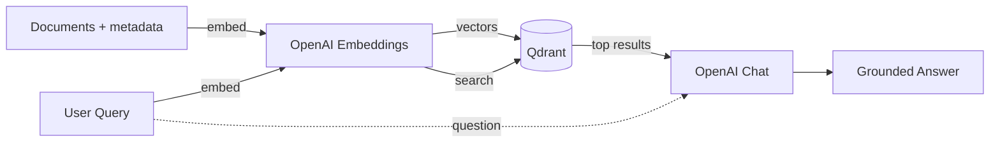

# Module 3 — Generation

> **~40 min** · Builds on [Module 2](../module-02/README.md)

## Learning objective

By the end of this module you will have:

- Understood **Retrieval-Augmented Generation (RAG)** — the core pattern behind AI-powered Q&A
- Built a `POST /chat` endpoint that retrieves documents, assembles context, and generates an answer
- Seen how the LLM is grounded in your indexed documents and refuses to hallucinate
- Made the system prompt **customizable** per request
- Added **tag filtering** to the chat retrieval step
- Added a **score threshold** to exclude low-relevance context

---

## Concepts introduced

### What is RAG?

**Retrieval-Augmented Generation** is a three-step pattern:

1. **Index** — turn documents into vectors, store in a vector database
2. **Retrieve** — embed the user's query, find the most similar documents
3. **Generate** — feed retrieved documents into an LLM for a grounded answer



### Why RAG instead of just asking the LLM?

LLMs have a training cutoff and don't know about **your** data. RAG bridges this gap:

| Without RAG | With RAG |
|-------------|----------|
| LLM answers from training data only | LLM answers from **your documents** |
| May hallucinate facts | Grounded — cites what's actually indexed |
| Generic answers | Specific to your domain |

### The system prompt

The system prompt tells the LLM the rules:

> *"Answer the user's question based **only** on the provided context documents. If the context does not contain enough information to answer, say so clearly — do not make up facts."*

This is the hard-coded default. The caller can override it with a custom `systemPrompt` per request (see below).

### Custom system prompts

The `systemPrompt` field lets the caller control the LLM's persona without changing any server code:

- A legal assistant: *"You are a legal advisor. Cite applicable statutes."*
- A customer support bot: *"Answer in a friendly tone. Suggest help articles."*
- A code reviewer: *"Review the code and suggest improvements."*

When `systemPrompt` is omitted, the default ("answer only from context") is used.

### Filtered retrieval

The `tags` field narrows which documents are retrieved as context. If you have thousands of documents across many categories, filtering ensures the LLM only sees relevant ones:

```json
{
  "question": "How does DNA replication work?",
  "tags": { "category": "biology" }
}
```

### Score threshold

The `scoreThreshold` field excludes low-similarity documents from the context window, even if they'd be in the top-K. This prevents the LLM from being distracted by irrelevant noise:

```json
{
  "question": "What is photosynthesis?",
  "k": 10,
  "scoreThreshold": 0.5
}
```

---

## What changed from Module 2

| New file | Purpose |
|----------|---------|
| `Endpoints/ChatEndpoints.cs` | `POST /chat` — embed question → search → build context → call LLM → return answer + sources |

| Changed file | What changed |
|-------------|-------------|
| `Models/Requests.cs` | Added `ChatRequest(Question, K, ScoreThreshold, Tags, SystemPrompt)`, `ChatResponse`, `ChatSource` records |
| `Program.cs` | Added `IChatClient` registration, `chatModel` config, `MapChatEndpoints()` |
| `docker-compose.yml` | Unchanged — Qdrant only |

### Code walkthrough

#### Chat request & response models — [`Requests.cs`](src/Qdrant.Demo.Api/Models/Requests.cs)

The chat contract covers both basic and advanced usage:

```csharp
public record ChatRequest(
    string Question,
    int K = 5,
    float? ScoreThreshold = null,
    Dictionary<string, string>? Tags = null,
    string? SystemPrompt = null
);

public record ChatResponse(
    string Answer,
    IReadOnlyList<ChatSource> Sources
);

public record ChatSource(
    string Id,
    float Score,
    string TextSnippet
);
```

- `K` controls how many documents are retrieved as context. 
- `ScoreThreshold` excludes low-relevance documents. 
- `Tags` filters by metadata. 
- `SystemPrompt` lets the caller set the LLM's persona. 
- All optional parameters have sensible defaults — existing callers continue to work unchanged.

#### The system prompt — [`ChatEndpoints.cs`](src/Qdrant.Demo.Api/Endpoints/ChatEndpoints.cs)

The system prompt sets the ground rules — the LLM must answer only from provided context:

```csharp
private const string DefaultSystemPrompt =
    """
    You are a helpful assistant. Answer the user's question based **only** on
    the provided context documents. If the context does not contain enough
    information to answer, say so clearly — do not make up facts.
    """;
```

When the caller provides a `systemPrompt`, it overrides this default:

```csharp
var systemPrompt = req.SystemPrompt ?? DefaultSystemPrompt;
```

#### The RAG pipeline — [`ChatEndpoints.cs`](src/Qdrant.Demo.Api/Endpoints/ChatEndpoints.cs)

The endpoint follows the classic RAG pattern — embed, retrieve, assemble context, generate:

```csharp
// 1. Embed the user's question
var vector = await embeddings.EmbedAsync(req.Question, ct);

// 2. Retrieve the top-K most similar documents
var filter = filters.CreateGrpcFilter(req.Tags);

var hits = await qdrant.SearchAsync(
    collectionName: collectionName,
    vector: vector,
    limit: (ulong)req.K,
    filter: filter,
    scoreThreshold: req.ScoreThreshold,
    payloadSelector: true,
    cancellationToken: ct);
```

The retrieval step applies all three controls: tag filtering via `CreateGrpcFilter`, result count via `K`, and quality gate via `scoreThreshold`.

The retrieved documents are numbered and combined into a single context string, then sent to the LLM along with the user's question:

```csharp
List<ChatMessage> messages =
[
    new ChatMessage(ChatRole.System, systemPrompt),
    new ChatMessage(ChatRole.User,
        $"""
        Context:
        {context}

        Question: {req.Question}
        """)
];

var response = await chatClient.GetResponseAsync(messages, cancellationToken: ct);
```

The `IChatClient` abstraction (from Microsoft.Extensions.AI) keeps the endpoint decoupled from any specific LLM provider.

---

## Step 1 — Start Qdrant and run the API

This module introduces the chat LLM (`gpt-4o-mini`). Make sure your `OPENAI_API_KEY` environment variable is set (see [Module 1](../module-01/README.md#step-1--set-your-openai-api-key)).

```bash
cd module-03
```

```bash
docker compose up -d
```

Then run the API locally:

```bash
dotnet run --project src/Qdrant.Demo.Api
```

## Step 2 — Index some knowledge

1. Open **Swagger UI** in your browser: **http://localhost:8080/swagger**
2. Find the **POST /documents/batch** endpoint, click **Try it out**
3. Paste the following JSON array and click **Execute**:

```json
[
  { "id": "bio-001", "text": "Photosynthesis is the process by which green plants convert sunlight into chemical energy, producing glucose and oxygen as byproducts.", "tags": { "category": "biology" } },
  { "id": "bio-002", "text": "DNA replication is the biological process of producing two identical copies of DNA from one original DNA molecule. It occurs during the S phase of the cell cycle.", "tags": { "category": "biology" } },
  { "id": "phys-001", "text": "Quantum entanglement is a phenomenon where two particles become linked, so the quantum state of one instantly influences the other, regardless of distance.", "tags": { "category": "physics" } }
]
```

You should see `total: 3, succeeded: 3` in the response.

## Step 3 — Ask a question (basic chat)

In **Swagger UI**, find the **POST /chat** endpoint, click **Try it out**, paste the following body and click **Execute**:

```json
{
  "question": "How do plants produce energy from sunlight?"
}
```

The response includes:
- **answer** — a generated paragraph grounded in the photosynthesis document
- **sources** — the documents used as context, with their similarity scores

```json
{
  "answer": "Plants produce energy from sunlight through a process called photosynthesis. During photosynthesis, green plants convert sunlight into chemical energy, producing glucose and oxygen as byproducts.",
  "sources": [
    {
      "id": "6b6492a2-38cb-3f55-a58f-47956db480ee",
      "score": 0.63336515,
      "textSnippet": "Photosynthesis is the process by which green plants convert sunlight into chemical energy, producing glucose and oxygen as byproducts."
    },
    {
      "id": "4524a713-b7c6-5758-b2f7-bee3ae446075",
      "score": 0.17604458,
      "textSnippet": "DNA replication is the biological process of producing two identical copies of DNA from one original DNA molecule. It occurs during the S phase of the cell cycle."
    },
    {
      "id": "e96f7130-3805-f45d-8964-729ec73ebf34",
      "score": 0.09342779,
      "textSnippet": "Quantum entanglement is a phenomenon where two particles become linked, so the quantum state of one instantly influences the other, regardless of distance."
    }
  ]
}
```

## Step 4 — Test the hallucination guardrail

Using **POST /chat** in Swagger UI, try:

```json
{
  "question": "What is the best pizza recipe?"
}
```

The LLM should respond with something like *"The provided context does not contain any information about pizza recipes. Therefore, I cannot answer your question based on the given documents."* — because the system prompt forbids making up facts.

## Step 5 — Custom system prompt

Try the same question about photosynthesis but with a different persona:

```json
{
  "question": "Tell me about photosynthesis",
  "systemPrompt": "You are a children's science teacher. Explain everything as if speaking to a 7-year-old. Use simple words and fun analogies."
}
```

Compare this with the default prompt — same question, very different tone.

## Step 6 — Filtered chat

Using **POST /chat** in Swagger UI, only pull from biology documents:

```json
{
  "question": "Tell me something interesting",
  "tags": { "category": "biology" }
}
```

The physics document is never seen by the LLM.

## Step 7 — Score threshold

Using **POST /chat** in Swagger UI, exclude weak matches:

```json
{
  "question": "best pizza recipe",
  "scoreThreshold": 0.6
}
```

With a 0.6 threshold, no documents about biology/physics should pass. The LLM will respond that it has no relevant context.

---

## Exercises

### Exercise 3.1 — Adjust K

Using **POST /chat** in Swagger UI, try `"k": 1` — the model gets less context and may give a shorter answer. Then try `"k": 10` — with only 3 documents, it still gets all of them.

### Exercise 3.2 — Ask a cross-domain question

Using **POST /chat** in Swagger UI, try:

```json
{
  "question": "Compare biological replication with quantum physics"
}
```

The model should pull from both biology and physics documents.

### Exercise 3.3 — Persona switch

Call `/chat` three times with the same question but different system prompts: a formal academic, a pirate, and a haiku poet. Observe how the tone changes while the factual content stays the same.

### Exercise 3.4 — Combine all controls

Using **POST /chat** in Swagger UI, try combining all parameters:

```json
{
  "question": "How do plants get energy?",
  "k": 3,
  "scoreThreshold": 0.4,
  "tags": { "category": "biology" },
  "systemPrompt": "Answer in exactly one sentence."
}
```

### Exercise 3.5 — Inspect the sources

The `sources` array shows exactly which documents the LLM used. Check the scores — higher scores mean the document was more relevant to the question.

---

## ✅ Checkpoint

At this point you have:

- [x] A working `POST /chat` endpoint — full RAG pipeline
- [x] Retrieval + generation in a single API call
- [x] LLM grounded in your indexed documents (no hallucination)
- [x] Customizable system prompts
- [x] Tag-filtered retrieval in the chat endpoint
- [x] Score threshold to exclude weak matches
- [x] Understanding of: RAG pattern, system prompts, context assembly, IChatClient, filtered RAG, context quality tuning

## 🧹 Clean Up

Before moving to the next module, stop everything started in this module:

1. **Stop the local API** — press `Ctrl+C` in the terminal where `dotnet run` is running
2. **Stop Docker containers** — from the `module-03` directory:

```bash
docker compose down
```

This stops Qdrant so the next module starts fresh.

**Next →** [Module 4 — Chunking](../module-04/README.md)
