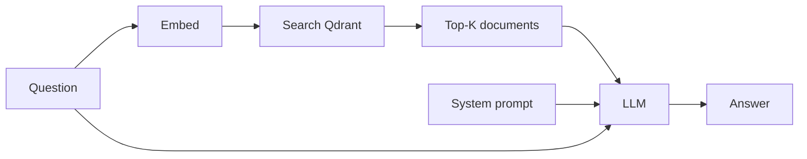

# Module 5 — RAG Chat

> **~20 min** · Builds on [Module 4](../module-04/README.md)

## Learning objective

By the end of this module you will have:

- Understood **Retrieval-Augmented Generation (RAG)** — the core pattern behind AI-powered Q&A
- Built a `POST /chat` endpoint that retrieves documents, assembles context, and generates an answer
- Seen how the LLM is grounded in your indexed documents and refuses to hallucinate

---

## Concepts introduced

### What is RAG?

**Retrieval-Augmented Generation** is a two-step pattern:

1. **Retrieve** — embed the user's question, search the vector database for similar documents
2. **Generate** — feed those documents as context to a Large Language Model (LLM), which writes a grounded answer



### Why RAG instead of just asking the LLM?

LLMs have a training cutoff and don't know about **your** data. RAG bridges this gap:

| Without RAG | With RAG |
|-------------|----------|
| LLM answers from training data only | LLM answers from **your documents** |
| May hallucinate facts | Grounded — cites what's actually indexed |
| Generic answers | Specific to your domain |

### The system prompt

The system prompt tells the LLM the rules:

> *"Answer the user's question based **only** on the provided context documents. If the context does not contain enough information to answer, say so clearly — do not make up facts."*

This is a hard-coded default in Module 5. In Module 6 you'll make it customizable.

---

## What changed from Module 4

| New file | Purpose |
|----------|---------|
| `Endpoints/ChatEndpoints.cs` | `POST /chat` — embed question → search → build context → call LLM → return answer + sources |

| Changed file | What changed |
|-------------|-------------|
| `Models/Requests.cs` | Added `ChatRequest(Question, K)`, `ChatResponse`, `ChatSource` records |
| `Program.cs` | Added `IChatClient` registration, `chatModel` config, `MapChatEndpoints()` |
| `docker-compose.yml` | Unchanged — Qdrant only |

### Code walkthrough

#### Chat request & response models — [`Requests.cs`](src/Qdrant.Demo.Api/Models/Requests.cs)

Three new records define the chat contract:

```csharp
public record ChatRequest(
    string Question,
    int K = 5
);

public record ChatResponse(
    string Answer,
    IReadOnlyList<ChatSource> Sources
);

public record ChatSource(
    string Id,
    float Score,
    string TextSnippet
);
```

`K` controls how many documents are retrieved as context. The response pairs the generated answer with the source documents and their similarity scores, so the caller can verify grounding.

#### The RAG pipeline — [`ChatEndpoints.cs`](src/Qdrant.Demo.Api/Endpoints/ChatEndpoints.cs)

The system prompt sets the ground rules — the LLM must answer only from provided context:

```csharp
private const string DefaultSystemPrompt =
    """
    You are a helpful assistant. Answer the user's question based **only** on
    the provided context documents. If the context does not contain enough
    information to answer, say so clearly — do not make up facts.
    """;
```

The endpoint follows the classic RAG pattern — embed, retrieve, assemble context, generate:

```csharp
// 1. Embed the user's question
var vector = await embeddings.EmbedAsync(req.Question, ct);

// 2. Retrieve the top-K most similar documents
var hits = await qdrant.SearchAsync(
    collectionName: collectionName,
    vector: vector,
    limit: (ulong)req.K,
    payloadSelector: true,
    cancellationToken: ct);
```

The retrieved documents are numbered and combined into a single context string, then sent to the LLM along with the user's question:

```csharp
// 4. Call the chat-completion model
List<ChatMessage> messages =
[
    new ChatMessage(ChatRole.System, DefaultSystemPrompt),
    new ChatMessage(ChatRole.User,
        $"""
        Context:
        {context}

        Question: {req.Question}
        """)
];

var response = await chatClient.GetResponseAsync(messages, cancellationToken: ct);
```

The `IChatClient` abstraction (from Microsoft.Extensions.AI) keeps the endpoint decoupled from any specific LLM provider.

---

## Step 1 — Start Qdrant and run the API

This module introduces the chat LLM (`gpt-4o-mini`). Make sure your `OPENAI_API_KEY` environment variable is set (see [Module 1](../module-01/README.md#step-1--set-your-openai-api-key)).

```bash
cd module-05
docker compose up -d    # starts Qdrant (http://localhost:6333)
```

Then run the API locally:

```bash
cd src/Qdrant.Demo.Api
```

```powershell
# PowerShell
$env:ASPNETCORE_URLS = "http://localhost:8080"
```

```bash
# Linux/macOS
export ASPNETCORE_URLS="http://localhost:8080"
```

```bash
dotnet run
```

## Step 2 — Index some knowledge

1. Open **Swagger UI** in your browser: **http://localhost:8080/swagger**
2. Find the **POST /documents** endpoint, click **Try it out**
3. Paste each JSON body below and click **Execute**:

**Document 1:**

```json
{
  "id": "bio-001",
  "text": "Photosynthesis is the process by which green plants convert sunlight into chemical energy, producing glucose and oxygen as byproducts.",
  "tags": { "category": "biology" }
}
```

**Document 2:**

```json
{
  "id": "bio-002",
  "text": "DNA replication is the biological process of producing two identical copies of DNA from one original DNA molecule. It occurs during the S phase of the cell cycle.",
  "tags": { "category": "biology" }
}
```

**Document 3:**

```json
{
  "id": "phys-001",
  "text": "Quantum entanglement is a phenomenon where two particles become linked, so the quantum state of one instantly influences the other, regardless of distance.",
  "tags": { "category": "physics" }
}
```

## Step 3 — Ask a question

In **Swagger UI**, find the **POST /chat** endpoint, click **Try it out**, paste the following body and click **Execute**:

```json
{
  "question": "How do plants produce energy from sunlight?"
}
```

The response includes:
- **answer** — a generated paragraph grounded in the photosynthesis document
- **sources** — the documents used as context, with their similarity scores

```json
{
  "answer": "Plants produce energy from sunlight through the process of photosynthesis. During photosynthesis, green plants convert sunlight into chemical energy, producing glucose and oxygen as byproducts.",
  "sources": [
    {
      "id": "6b6492a2-38cb-3f55-a58f-47956db480ee",
      "score": 0.63348544,
      "textSnippet": "Photosynthesis is the process by which green plants convert sunlight into chemical energy, producing glucose and oxygen as byproducts."
    },
    {
      "id": "4524a713-b7c6-5758-b2f7-bee3ae446075",
      "score": 0.17606789,
      "textSnippet": "DNA replication is the biological process of producing two identical copies of DNA from one original DNA molecule. It occurs during the S phase of the cell cycle."
    },
    {
      "id": "e96f7130-3805-f45d-8964-729ec73ebf34",
      "score": 0.09343319,
      "textSnippet": "Quantum entanglement is a phenomenon where two particles become linked, so the quantum state of one instantly influences the other, regardless of distance."
    }
  ]
}
```

## Step 4 — Ask something not in the index

Using **POST /chat** in Swagger UI, try:

```json
{
  "question": "What is the best pizza recipe?"
}
```

The LLM should respond with something like *"The provided context does not contain information about pizza recipes"* — because the system prompt forbids making up facts.

---

## Exercises

### Exercise 5.1 — Adjust K

Using **POST /chat** in Swagger UI, try `"k": 1` — the model gets less context and may give a shorter answer. Then try `"k": 10` — with only 3 documents, it still gets all of them.

### Exercise 5.2 — Ask a cross-domain question

Using **POST /chat** in Swagger UI, try:

```json
{
  "question": "Compare biological replication with quantum physics"
}
```

The model should pull from both biology and physics documents.

### Exercise 5.3 — Inspect the sources

The `sources` array shows exactly which documents the LLM used. Check the scores — higher scores mean the document was more relevant to the question.

### Exercise 5.4 — Run the tests

```bash
cd module-05
dotnet test
```

You should see **27 tests passed**.

---

## ✅ Checkpoint

At this point you have:

- [x] A working `POST /chat` endpoint — full RAG pipeline
- [x] Retrieval + generation in a single API call
- [x] LLM grounded in your indexed documents (no hallucination)
- [x] Understanding of: RAG pattern, system prompts, context assembly, IChatClient

## 🧹 Clean Up

Before moving to the next module, stop everything started in this module:

1. **Stop the local API** — press `Ctrl+C` in the terminal where `dotnet run` is running
2. **Stop Docker containers** — from the `module-05` directory:

```bash
docker compose down
```

This stops Qdrant so the next module starts fresh.

**Next →** [Module 6 — Advanced Chat](../module-06/README.md)
